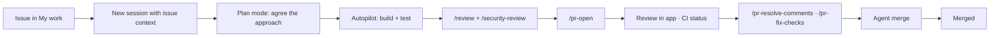

# Lab: GitHub Copilot App: Zero to Hero

> **Duration:** ~2 hours | **Level:** Beginner → Intermediate | **Prerequisites:** Active [GitHub Copilot subscription](https://github.com/features/copilot/plans) (or a BYOK model provider), [Git](https://github.com/git-guides/install-git), [Node.js 22+](https://nodejs.org/), and a GitHub repository you can push to

## Objective

In this lab you will **build, review, and ship a Task Manager REST API** using the **GitHub Copilot app** — the agent-native desktop application for directing multiple AI agents at once.

You won't just chat with an agent. You'll run **parallel agent sessions on isolated worktrees**, hand work off between **Plan / Interactive / Autopilot** modes, pick up **issues** and land **pull requests** without leaving the app, build a **canvas** that you and the agent share, **orchestrate child sessions**, and set up **automations** that keep working after you close your laptop.

The lab is deliberately structured to work three ways:

| Audience | How to use it |
|----------|---------------|
| **CSA-led demo** | Follow [Exercise 12](#exercise-12--the-csa-demo-fast-path) for a 30-minute compressed script |
| **Follow-along workshop** | Run Exercises 1–11 with the audience, skipping the ⭐ *Optional deep-dives* |
| **Self-guided lab** | Run everything end to end, using the ✅ Checkpoints to confirm progress |

:::note The Copilot app is evolving fast
Slash commands, panes, and feature availability change frequently. Type `/` in the prompt box to see what's currently available in your context, and check the [official docs](https://docs.github.com/copilot/concepts/agents/github-copilot-app) if something looks different from what's described here.
:::

---

## What You'll Build

A **Task Manager REST API** — plus the workflow around it:

- Express.js server with CRUD endpoints, Zod validation, and error handling
- Jest tests generated and iterated on by an agent in Autopilot mode
- A feature delivered **from a GitHub issue** all the way to a **merged pull request**, without leaving the app
- Two features built **simultaneously** in parallel sessions on separate branches
- A custom **canvas** — a shared UI surface you and the agent both manipulate
- A **scheduled automation** that triages your repo every morning
- Repository instructions, a plugin, and an MCP server wired into the app

## Why the App (and Not Just Chat or the CLI)?

Before you start, it helps to know what problem the app actually solves. Copilot is available in the IDE, in the CLI, on GitHub.com, and in this desktop app. They overlap — but the app is built for a specific shape of work.

| Capability | IDE Chat | Copilot CLI | **Copilot App** |
|-----------|----------|-------------|-----------------|
| Inline code completion | ✅ | ❌ | ❌ |
| Single agent session | ✅ | ✅ | ✅ |
| **Many agents in parallel, each on its own branch** | ❌ | ⚠️ manual worktrees | ✅ **built in** |
| **Visual session switcher / control center** | ❌ | ❌ | ✅ |
| Issue triage → session → PR → merge in one place | ❌ | ⚠️ partial | ✅ |
| CI status + review comments in the same surface | ❌ | ❌ | ✅ |
| **Canvases (shared human+agent UI surfaces)** | ❌ | ❌ | ✅ |
| Scheduled/triggered automations | ❌ | ❌ | ✅ |
| Cloud sandbox execution | ❌ | ❌ | ✅ (public preview) |
| Runs when your machine is off | ❌ | ❌ | ✅ (cloud automations) |

:::tip The one-sentence pitch
The app is built on Copilot CLI, so everything you know from the CLI still works — but it adds a **control center** for directing *many* agents across *many* branches, and native GitHub lifecycle management on the same screen.
:::

The features you'll spend the most time on in this lab are the ones in **bold** above — they're the ones that are hard or impossible to reproduce anywhere else.

---

## Exercise 1 — Install, Sign In, and Orient

### 1.1 Install the App

Download the app for your platform from the [GitHub Copilot app download page](https://github.com/features/ai/github-app). macOS, Windows, and Linux are all supported.

:::note Business and Enterprise users
The **GitHub Copilot app policy** must be enabled for your organization or enterprise. It is enabled by default and is *separate* from the Copilot CLI policy. If the app refuses to sign you in, that policy is the first thing to check.
:::

### 1.2 Sign In

1. Open the app and click **Sign in to GitHub**.
2. Complete the browser OAuth flow.
3. If you use GitHub Enterprise Server, choose **Use GitHub Enterprise** and enter your server address.
4. If you don't have a Copilot plan, you can choose to **continue with your own model provider** (BYOK) and supply an API key instead.
5. Pick a theme and finish onboarding.

### 1.3 Connect Your First Project

A **project** is a folder or repository the app can work in. During onboarding you'll be offered repositories based on your recent GitHub activity. You can also add one later:

1. Click **+** in the sidebar next to **Sessions**.
2. Under **Add project from**, choose one of:
   - **Local folder or repository** — a folder already on your machine
   - **GitHub repository** — browse and clone from GitHub
   - **Repository URL** — clone from any Git URL (Azure DevOps, GitLab, self-hosted, or private repos without app access)

For this lab, create a **new empty repository** on GitHub named `task-manager-api`, then add it as a project via **GitHub repository**.

:::tip Use an organization repo
Later exercises use cloud automations and the cloud agent, which work best in an organization-owned repository. If you have the option, create the repo in an org rather than your personal account.
:::

### 1.4 Learn the Sidebar

Take a minute to click through each sidebar area. This map is the single most useful thing to internalize — every exercise below lives in one of these:

| Sidebar area | What lives there |
|--------------|------------------|
| **My work** | Your issues and pull requests, filtered into sections (All, Active, Review requests, Done). CI status and reviews live here too. |
| **Automations** | Saved agent tasks that run on a schedule, on a repo event, or on demand |
| **Customize** | Plugins, skills, MCP servers, and canvases — discover and manage |
| **Search** | Search across your connected repositories |
| **Sessions** | Active agent sessions, grouped by project. This is your parallel-work control center. |
| **Chats** | Conversations that *don't* create a branch or worktree |

### 1.5 Your First Session

1. Click **+** next to **Sessions** and choose your `task-manager-api` project.
2. From the dropdown under the prompt box, choose **where the session runs** — this matters, and you'll explore it in [Exercise 4](#exercise-4--parallel-sessions-the-app-superpower):
   - **New working tree** (default) — an isolated git worktree on a fresh branch
   - **Local repository** — your existing checkout, on its current branch
   - **Cloud sandbox** (public preview) — a fully isolated environment hosted by GitHub
3. Below the prompt field, set:
   - **Session mode:** `Interactive`
   - **Model:** `Auto` (the app picks based on task complexity) — or pick a specific model
   - **Reasoning effort:** `Medium`
4. Prompt:

```text
Describe this repository: what's in it, what language and tooling it uses, and what you'd need in order to build a Node.js REST API here.
```

Because the repo is empty, the agent will tell you exactly that — which is the honest answer, and a good first signal that it's actually reading your files rather than guessing.

### 1.6 Inspect the Session Header

Look at the top of the session. You should be able to identify:

- The **project** (repository)
- The **branch / worktree** this session owns
- Tabs or buttons for **Changes** (the diff) and, once one exists, **PR**

:::note Session naming
Sessions get auto-generated names. Use `/rename` to give a session a meaningful name — this becomes essential the moment you have five sessions in the sidebar.
:::

### ✅ Checkpoint

You have the app installed and authenticated, one project connected, and one live session running in its own worktree. You can name every area of the sidebar.

---

## Exercise 2 — Chats vs. Sessions: Think Before You Branch

One of the most common mistakes new app users make is starting a full session — creating a branch and a worktree — just to ask a question. **Chats** exist for exactly that.

### 2.1 Open a Chat

Click **Chats** in the sidebar, then start a new conversation. Notice: no branch is created, no worktree is created, no diff pane appears.

### 2.2 Scope the Work in a Chat

```text
I'm about to build a Task Manager REST API in Node.js with Express and Zod, storing tasks in memory.

Before I write any code, help me pin down:
1. The resource shape for a task (fields, types, constraints)
2. The full endpoint list including filtering and stats
3. Which validation and error-handling patterns are worth standardizing up front
4. What the test strategy should be

Ask me clarifying questions if anything is ambiguous. Don't write code yet.
```

Iterate here until the design feels right. Answer its questions. **This is cheap thinking.**

### 2.3 Carry the Decision Into a Session

Once the design settles, ask:

```text
Summarize our agreed design as a concise, self-contained implementation brief I can paste into a coding session. Include the task schema, endpoint list, validation rules, and test expectations.
```

Copy that brief — you'll use it in the next exercise.

### 2.4 Why This Matters

| Use | Reach for |
|-----|-----------|
| "How should I model this?" | **Chat** |
| "What's the tradeoff between X and Y?" | **Chat** |
| "Explain how this repo's auth works" | **Chat** |
| "Implement the thing we agreed on" | **Session** |
| "Fix this failing test" | **Session** |
| "Pick up issue #42" | **Session** (started from the issue) |

Chats keep your Sessions list clean, avoid throwaway branches, and — per GitHub's own guidance — reduce rework and AI credit burn by clarifying requirements *before* an agent starts writing files.

:::tip Archive, don't delete
Right-click a chat in the sidebar and choose **Archive chat** to keep its history without cluttering the list. **Settings → Sessions → Manage sessions** lets you search, filter, bulk-archive, and even see how much disk space each session's working files consume.
:::

### ✅ Checkpoint

You understand the Chats/Sessions split, you've designed the API in a chat, and you have an implementation brief ready to hand to an agent.

---

## Exercise 3 — Plan Mode → Autopilot: Scaffold the API

Now you'll use the mode ladder that defines app workflow: **Plan** to agree on the approach, then **Autopilot** to let the agent execute it end to end.

### 3.1 The Three Session Modes

| Mode | Who drives | Use it when |
|------|-----------|-------------|
| **Interactive** | You and the agent together — it proposes, waits for your input | You need tight steering, unfamiliar code, risky changes |
| **Plan** | Agent proposes a plan; **you approve before any execution** | Scope is fuzzy, or the change is large enough that you want to review the approach first |
| **Autopilot** | Agent works fully autonomously — writes code, runs tests, iterates | The task is well defined and verifiable |

You can switch at any time with the dropdown, or with `/interactive`, `/plan`, and `/autopilot`.

### 3.2 Enter Plan Mode

In your session, switch the mode dropdown to **Plan** (or type `/plan`), then paste your brief from Exercise 2. If you skipped it, use this:

```text
Create a Node.js REST API project for a task manager in this repository.

Requirements:
- Express.js server, entry point src/index.js, port 3000
- Zod for validation
- src/routes/tasks.js with full CRUD: GET /tasks, GET /tasks/:id, POST /tasks, PUT /tasks/:id, DELETE /tasks/:id
- src/middleware/errorHandler.js for centralized error handling, using an AppError pattern
- In-memory array as the data store — no database
- A task has: id (uuid), title (string, 1-100 chars, required), description (string, optional, max 500), status (enum: todo | in-progress | done, defaults to todo), createdAt
- Jest + supertest configured, with tests for happy paths and validation failures
- package.json scripts: start, dev, test
- A Node.js .gitignore

Plan the work. Do not execute yet.
```

### 3.3 Actually Read the Plan

The agent produces a step-by-step plan: files it will create, what goes in each, commands it will run. **This is the highest-leverage 60 seconds in the whole lab.** Check:

- Is the file structure what you want?
- Are the dependencies right (and not bloated)?
- Does the test strategy match what you agreed?
- Is anything missing — logging, README, health endpoint?

Push back before approving:

```text
Two changes before we execute:
1. Add request logging middleware that logs method, URL, status, and response time.
2. Add a GET /health endpoint returning status, uptime, and version from package.json.
Update the plan.
```

### 3.4 Approve and Run on Autopilot

Approve the plan and let the session continue in **Autopilot**. The agent will:

1. Create the project structure and every file
2. Run `npm init` and install dependencies
3. Write the tests
4. Run the tests, read the failures, and fix them — iterating until green

Watch the transcript. You're seeing the agent's actual tool calls, not a summary.

:::note Approvals and auto-approval
Autopilot may still ask for permission for certain tools. `/allow-all-tools` (aliased `/yolo`) turns on auto-approval for the session. Use it when you're actively watching. `/reset-allowed-tools` clears session approvals and turns auto-approval back off — get in the habit of running it when you go back to careful work.
:::

### 3.5 Inspect the Result

Click **Changes** above the prompt box to see the full diff of everything the agent created.

Then open a terminal *inside the app* to verify it actually runs:

```text
/terminal npm start
```

This opens a terminal in the right-hand panel — a canvas — and runs the command there. In a second terminal, or after stopping the server:

```text
/terminal curl -s -X POST http://localhost:3000/tasks -H "Content-Type: application/json" -d '{"title":"Learn the Copilot app"}'
```

:::tip The terminal is a canvas
`/terminal` isn't a shell-out; it's a canvas in the side panel. That's your first taste of the canvas concept you'll build on in [Exercise 9](#exercise-9--canvases-the-shared-surface).
:::

### 3.6 Ask It to Explain Its Own Work

```text
Summarize the architecture you just built. What does each file do, and what are the three weakest points in this implementation?
```

Asking for weaknesses (rather than a summary alone) consistently produces more useful output than asking "does this look good?"

### ✅ Checkpoint

You have a working, tested Express API — designed in Plan mode, built in Autopilot, verified in an in-app terminal. You know how to switch modes and how to reset tool permissions.

---

## Exercise 4 — Parallel Sessions: The App Superpower

This is the exercise to pay attention to. Everything up to now you could have done in the CLI or an IDE. **This you cannot easily do anywhere else.**

### 4.1 The Problem Parallel Sessions Solve

A single agent session is a queue: you ask, it works, you wait. Real work isn't a queue — you have a feature to build, a flaky test to chase, and a docs update that's been sitting for a week.

The app gives every session its **own git worktree and branch**, so three agents can work in the same repository at the same time without touching each other's files.

### 4.2 Where a Session Runs

When you start a session, the dropdown under the prompt box offers three runtimes:

| Runtime | What it is | Use when |
|---------|-----------|----------|
| **New working tree** | A fresh git worktree + branch, isolated on disk | **Default.** Anything parallel. |
| **Local repository** | Your existing checkout, current branch | You want changes in the checkout you already have open in an IDE |
| **Cloud sandbox** *(public preview)* | Fully isolated environment hosted by GitHub | Untrusted code, heavy installs, or when you don't want the agent touching your machine at all |

:::note Why worktrees, not clones
A worktree shares the repo's object database and history but has its own working directory and branch. That means near-instant creation and no duplicated `.git` — but also that two sessions can't check out the *same* branch. The app handles branch assignment for you.
:::

### 4.3 Launch Three Sessions at Once

Commit your Exercise 3 work first (ask the agent, or use `/pr-open` later). Then create three new sessions from the **+** button, each in a **new working tree**, each with a clear name via `/rename`.

**Session A — "filtering"** *(Interactive mode)*

```text
Add query-parameter filtering to GET /tasks:
- ?status=todo|in-progress|done
- ?q=<text> for case-insensitive search across title and description
- ?sort=createdAt|title and ?order=asc|desc
Validate query params with Zod and return 400 on invalid values. Add tests for each filter and combination.
```

**Session B — "stats"** *(Autopilot mode)*

```text
Add GET /tasks/stats returning:
{ total, byStatus: { todo, inProgress, done }, oldest, newest, completionRate }
completionRate is done/total as a percentage rounded to one decimal, 0 when total is 0.
Add tests including the empty-store edge case. Follow the existing code conventions.
```

**Session C — "docs"** *(Interactive mode)*

```text
Generate a comprehensive README.md: project description, setup, every endpoint with request/response examples and curl commands, error format, and how to run tests. Read the actual route files — don't invent endpoints.
```

### 4.4 Watch Them Run Concurrently

Click between the three sessions in the sidebar. Each has:

- Its own branch and worktree
- Its own transcript and context window
- Its own diff under **Changes**
- Its own model and reasoning-effort settings

Session B (Autopilot) will keep working while you're steering Session A. **That's the whole point** — your attention becomes the scarce resource, not the agent's throughput.

:::tip Match model to task
Set Session C (docs) to a lighter, faster model and Session A (filtering logic + validation) to a higher-capability one with higher reasoning effort. Per-session model selection is one of the quietest but most cost-effective features in the app.
:::

### 4.5 Land Them Independently

Each session can open its own pull request (`/pr-open`) against `main`. Three PRs, three branches, three review threads — no rebasing pain, because they never shared a working directory.

### 4.6 Clean Up

Go to **Settings → Sessions → Manage sessions**. Search and filter your sessions, check the disk-usage columns, and archive or delete the ones you're done with.

:::note Worktrees accumulate
Every session is real disk space. The **Manage sessions** view exists precisely because it's easy to end up with twenty stale worktrees. Make cleanup part of your routine.
:::

### ✅ Checkpoint

You ran three agents concurrently in one repository, each on an isolated branch, with per-session models and modes. You know the three session runtimes and when to use each.

---

## Exercise 5 — Issue-Driven Development in "My work"

Most real work doesn't start with a blank prompt — it starts with an issue. The app makes the issue the entry point.

### 5.1 Explore "My work"

Click **My work**. You'll see your issues and pull requests grouped into sections — by default **All**, **Active**, **Review requests**, and **Done**.

Try these:

- Use the search bar inside a section with a qualifier: `label:bug`, `is:open author:@me`
- Edit a default section's filter
- Add a new section with your own filter, e.g. `assignee:@me is:open label:enhancement`

:::tip Make it your morning view
A section filtered to `review-requested:@me is:open` turns My work into a genuine triage dashboard — and it shows CI status inline, so you can see what's actually reviewable.
:::

### 5.2 Have the Agent File an Issue

In any session:

```text
Create an issue in this repository proposing bulk operations for the task API:
- POST /tasks/bulk to create multiple tasks in one request
- DELETE /tasks/bulk to delete by an array of ids
- PATCH /tasks/bulk/status to update status on multiple tasks
Include acceptance criteria, validation rules, and edge cases (partial failures, empty arrays, unknown ids).
```

:::note Templates are respected
When an agent creates an issue, it picks a repository issue template appropriate to the type. Name a specific template in your prompt if you want a particular one. The same applies to pull request templates.
:::

### 5.3 Start a Session From the Issue

1. Open **My work** and click the issue you just created.
2. Click **New session**. The app opens a session **with the issue context already loaded** — you don't paste anything.
3. Set the mode to **Plan**.
4. Prompt:

```text
Implement this issue. Plan first, and call out anything in the acceptance criteria that's ambiguous or that you'd push back on.
```

### 5.4 Review, Refine, Execute

The agent will plan against the issue's acceptance criteria. Review it, refine it, approve it, and let it build in Autopilot.

### 5.5 Preserve the Reasoning

Ask the agent to attach its implementation plan back to the issue as an artifact:

```text
Attach your implementation plan to this issue as an artifact so reviewers can see the approach before they read the diff.
```

This is a small habit with an outsized payoff: the *why* lives where stakeholders already look, instead of evaporating with your session transcript.

### ✅ Checkpoint

You filed an issue from an agent, launched a session directly from that issue with context pre-loaded, planned against its acceptance criteria, and attached the plan back to the issue.

---

## Exercise 6 — Verification: Review Before Anyone Else Does

The app ships several distinct review agents. They're not redundant — each one looks for something different.

### 6.1 `/review` — General Code Review

In the session with your bulk-operations changes:

```text
/review
```

This reviews the **current session's changes** for bugs, logic errors, and correctness problems. It ignores style noise.

### 6.2 `/security-review` — Vulnerability-Focused

```text
/security-review
```

:::note Public preview
`/security-review` is currently in public preview and subject to change.
:::

This runs a security-focused pass over your current diffs and returns **prioritized findings with severity and confidence scores**, plus suggested fixes you can apply and verify in the same session.

Crucially, this is a *pre-PR* check. It complements — rather than replaces — code scanning, Dependabot, and secret scanning, by catching issues before you ever push.

### 6.3 `/rubber-duck` — A Second Opinion From a Different Model

```text
/rubber-duck Critique my bulk operations implementation. Focus on partial-failure semantics and whether the API contract is coherent.
```

The rubber duck agent is a built-in constructive critic that **runs on a different model than the one driving your session**. That's the key detail: you get genuinely independent judgment rather than a model agreeing with itself.

When enabled, Copilot can also consult it automatically at key points — passing work over, receiving the critique, and deciding how to apply it before continuing.

:::note Model requirement
The rubber duck agent is currently available only when the main agent is using a Claude or GPT model.
:::

### 6.4 `/spar` — Adversarial Pressure-Testing

```text
/spar We're storing tasks in memory and shipping bulk endpoints with no rate limiting. Argue why that's a mistake.
```

`/spar` runs adversarial reasoning to challenge your approach. Use it on design decisions, not line-level code.

### 6.5 Introduce a Bug and Catch It

Let's prove these agents earn their keep. Ask for a deliberately broken change:

```text
In src/routes/tasks.js, change the DELETE route to use findIndex but remove the check for -1 before calling splice. Make only that change and do not fix it.
```

Now start the server and create two tasks, then try to delete one that doesn't exist:

```text
/terminal npm start
```

```text
/terminal curl -s -X POST http://localhost:3000/tasks -H "Content-Type: application/json" -d '{"title":"Task 1"}'
```

```text
/terminal curl -s -X POST http://localhost:3000/tasks -H "Content-Type: application/json" -d '{"title":"Task 2"}'
```

```text
/terminal curl -s -X DELETE http://localhost:3000/tasks/does-not-exist && curl -s http://localhost:3000/tasks
```

No error, no crash — but **one of your real tasks is gone**. `splice(-1, 1)` removes the last element. This is exactly the class of bug that passes a casual eyeball review.

Now:

```text
/review
```

Confirm it finds the missing bounds check, and apply the fix.

### 6.6 Compare the Reviewers

| Command | Looks for | Runs on |
|---------|----------|---------|
| `/review` | Bugs, logic errors, correctness in current changes | Session changes |
| `/security-review` | Exploitable vulnerabilities, ranked by severity + confidence | Session changes |
| `/rubber-duck` | Design and implementation critique | A *different* model than your session |
| `/spar` | Adversarial challenge to your reasoning | Your stated approach |

### ✅ Checkpoint

You ran four different verification agents, understand what each is for, and caught a genuinely subtle bug with `/review` before it reached a pull request.

---

## Exercise 7 — The Pull Request Lifecycle, End to End

Here's where the app collapses three tools into one. You'll take a change from diff to merged without opening a browser.

### 7.1 Open the PR From the Session

```text
/pr-open
```

This opens a pull request from the current session's changes, following the repository's PR template. You can also click **Create PR** above the prompt box.

Once it exists, a **PR** tab appears above the prompt box — click it to see the pull request inside the app.

### 7.2 Review a PR in the App

Open **My work** and click a pull request. You get:

- The **overview**: summary, **CI check results**, review activity
- The **Files changed** tab: the full diff
- A **New session** button to start a session scoped to that PR

Start a session on the PR and try both halves of reviewing:

**Ask the agent to assess it:**

```text
Review this pull request as a senior engineer. Focus on correctness and API contract consistency with the existing endpoints. Flag anything that would break existing clients.
```

**Leave your own review comments on the diff**, right from the session. When you're done, return to the pull request detail view and click **Review** at the top to submit.

:::tip Staged, not posted
Comments you draft in a session are staged into your pending review — nothing is posted to GitHub until you submit the review. Draft freely.
:::

### 7.3 Respond to Review Feedback

Now flip roles. On a PR of your own with review comments:

1. Open the pull request and scroll to the review comments.
2. Click the **Copilot / Fix** button on a comment to have an agent address it.

Or do it in bulk from the session:

```text
/pr-resolve-comments
```

This runs a prompt to work through the unresolved review comments on the current pull request.

:::note Reply in the thread
When an agent resolves a comment, the reply lands **in the review thread** — under the reviewer's comment — not as a disconnected top-level PR comment. That's how review conversations are supposed to work, and it's a meaningful difference from pasting a summary at the bottom of the PR.
:::

### 7.4 Fix Failing CI

CI check status is shown at the bottom of the pull request view. When something's red:

```text
/pr-fix-checks
```

Or click **Fix failing checks** on the pull request. The agent reads the failure output, diagnoses it, and pushes a fix.

### 7.5 Merge — Manually or With Agent Merge

Straightforward merge:

```text
/pr-merge
```

Or turn on **agent merge** at the top of the app. Agent merge prompts the workspace's Copilot session to:

- Read the pull request
- Fix whatever is blocking it — review comments, failing checks, merge conflicts
- Merge it as soon as GitHub allows

It **runs in the background, survives app restarts, and turns itself off once the PR is merged.**

:::tip This is the "walk away" feature
Agent merge is the clearest example of the app's design philosophy: state the outcome you want, and let a persistent background process drive toward it. Turn it on for a low-risk PR and watch what happens while you work on something else.
:::

### 7.6 The Full Loop

You have now done, in one window, what normally takes a terminal, an IDE, and several browser tabs:



### ✅ Checkpoint

You opened, reviewed, revised, un-blocked, and merged a pull request without leaving the app — including resolving review threads and fixing CI through agents.

---

## Exercise 8 — Orchestration: Agents That Direct Agents

Exercise 4 showed you running sessions in parallel *by hand*. Orchestration lets an agent create and steer those sessions for you.

### 8.1 `/orchestrate` — Coordinate Across Sessions and Repos

```text
/orchestrate Split the remaining Task Manager work into independent workstreams and run them in parallel child sessions:
1. Add pagination (?page, ?limit) to GET /tasks with tests
2. Add a rate-limiting middleware with tests
3. Add OpenAPI/Swagger documentation for every endpoint
Each workstream should end with a pull request. Report back with the PR links when they're done.
```

The `orchestrate` skill creates child sessions, gives each one full context, and coordinates them. Watch the **Sessions** sidebar — child sessions appear **nested under their creator**, which makes the parent/child relationship visible at a glance.

:::note Cost awareness
Orchestration can spawn several agents at once. That's the point — but it also multiplies AI credit usage. Scope each workstream tightly and prefer this for genuinely independent work.
:::

### 8.2 `/spawn` — One Focused Child Session

When you don't need a whole fleet, just hand off one task:

```text
/spawn Update the README to document the new pagination and rate-limiting behavior, matching the existing documentation style. Report back when done.
```

The child session runs independently and can message you back.

### 8.3 `/fork` and `/merge-to-parent` — Explore an Alternative

Sometimes you want to try a different direction *without* losing your current one:

```text
/fork
```

This forks the current session at the latest turn into a new worktree, carrying your conversation history with it. In the fork, try the other approach:

```text
Rewrite the in-memory store as a small repository class with an interface that would let us swap in SQLite later, without changing the route handlers.
```

If you like the result:

```text
/merge-to-parent
```

If you don't, archive the fork. Your original session was never touched.

:::tip Fork = branching your *conversation*, not just your code
Git branches your files. `/fork` branches your files **and** the agent's accumulated context. That's a materially different tool, and it has no real equivalent in an IDE chat.
:::

### 8.4 `/fleet` — Parallel Subagents on One Task

```text
/fleet Audit this codebase for missing error handling, missing input validation, and untested code paths. Produce one consolidated prioritized report.
```

`/fleet` launches multiple agents in parallel on a **single** task, then consolidates. Use `/fleet` for one big job; use `/orchestrate` or `/spawn` for separate jobs.

### 8.5 `/pr-stack` — Dependent Pull Requests

For a change too big for one PR but where each layer depends on the last:

```text
/pr-stack Break the persistence refactor into a stack of dependent PRs:
1. Introduce the repository interface (no behavior change)
2. Move the in-memory store behind that interface
3. Add a SQLite implementation behind a feature flag
```

This creates a stack of dependent pull requests with **one child session per layer**, plus native GitHub stack linking — so reviewers can review small, coherent diffs instead of one 2,000-line PR.

### 8.6 Choosing the Right Tool

| You want to… | Use |
|--------------|-----|
| Run several *unrelated* tasks in parallel | `/orchestrate` |
| Hand off one side task | `/spawn` |
| Throw more agents at *one* big task | `/fleet` |
| Try an alternative without losing your current path | `/fork` |
| Ship a big change as reviewable layers | `/pr-stack` |
| Run your own parallel work manually | Multiple sessions (Exercise 4) |

### ✅ Checkpoint

You've used orchestration, spawning, forking, fleets, and PR stacks — and you can articulate which one fits which shape of work.

---

## Exercise 9 — Canvases: The Shared Surface

If parallel sessions are the app's most *useful* feature, canvases are its most *distinctive*. Nothing else in the Copilot family has this.

### 9.1 What a Canvas Actually Is

Chat is good for defining intent. But most real work happens in a **work surface**: a terminal, a browser, a document, a dashboard, a board. A **canvas** is that surface, opened in the app's right-hand panel, and it is **bidirectional**:

- The **agent** updates the canvas while it works
- **You** edit the same surface directly
- The agent can then continue *from your edits*

You've already used two canvases without thinking about it: `/terminal` opens a terminal canvas, and viewing a markdown artifact opens an editor canvas.

### 9.2 Browse the Featured Canvases

1. Click **Customize** in the sidebar.
2. Click **Canvas**.
3. Browse the featured list. Some canvases come from plugins and require installing the plugin first.
4. Click **Installed** to see everything already available to you.

### 9.3 Build Your Own Canvas

This is the exercise that usually gets the biggest reaction in a demo. In an active session:

```text
/create-canvas Create an agentic kanban board for this repository's tasks.

People should be able to:
- Add a card with a title, description, and status
- Drag or move cards between columns (Todo, In Progress, Done)
- Filter cards by status and by text search

The agent should be able to call:
- get_board to read the current board state
- add_card to create a card
- move_card to change a card's status
- summarize_board to report progress

Persist the board state so it survives a restart. Scope it to the project so my team gets it too.
```

Choose the scope when prompted:

| Scope | Location | Use for |
|-------|----------|---------|
| **Project** | `.github/extensions` | Team-shared canvases, committed to the repo |
| **User** | `~/.copilot/extensions` | Personal canvases on your machine |

The agent builds the canvas and opens it in the right side panel.

### 9.4 Work In It — Both Directions

**You drive:** add a few cards through the UI, move one to In Progress.

**The agent drives:**

```text
Read the board and add a card for every open issue in this repository, in the Todo column.
```

```text
Summarize the board: what's in flight, what's blocked, and what I should pick up next.
```

Notice that both of you are manipulating the *same state*. You didn't describe the board to the agent, and it didn't describe the board back to you.

### 9.5 Iterate on the Canvas Itself

Canvases aren't fixed once built:

```text
Add a "Blocked" column to the board, an agent-callable block_card action that takes a reason, and show the blocking reason on the card.
```

### 9.6 How It's Structured

A canvas extension lives in its own directory under `.github/extensions` (project) or `~/.copilot/extensions` (user), and typically includes:

- `package.json` — extension metadata and dependencies
- An entry file such as `extension.mjs` — canvas behavior and agent-callable capabilities
- Optional JSON artifacts (e.g. an `artifacts/` directory) for persisted state

Because a project-scoped canvas is committed to the repo, **your whole team gets it on their next pull.**

### 9.7 Other Things Worth Building as Canvases

- **Issue triage board** — top issues, recurring themes, user pain points for a repo
- **Markdown day-planner** — meetings, prioritized issues and PRs, plus buttons to launch and monitor agent sessions
- **Release checklist** — gated steps the agent ticks off as it verifies each one
- **Incident canvas** — timeline, current hypothesis, commands run, findings
- **Document canvases** — open and edit documents, spreadsheets, and slide decks in the app

### ✅ Checkpoint

You've built a working canvas from a prompt, driven it from both the UI and the agent, iterated on its capabilities, and know where it lives on disk and how to share it with your team.

---

## Exercise 10 — Customize: Instructions, Plugins, MCP, Skills, Agents

The app inherits the entire Copilot CLI customization ecosystem and adds a UI for discovering and managing it.

### 10.1 Repository and Global Instructions

The app supports two layers of instruction beyond the standard repo files:

**Global (every session, every project):**
1. Open app **settings** → **Sessions**
2. Under **Instructions**, edit **App instructions**

Add something like:

```text
Always explain the "why" behind a change, not just the "what".
Prefer small, reviewable diffs. If a change exceeds ~300 lines, propose splitting it.
Never commit secrets, and flag any credential-shaped string you encounter.
```

**Repository-specific (every session for one repo):**
1. Open app **settings** → **Projects**
2. Click the repository
3. Edit the **Instructions** field

**Repo files (committed, shared with your team):**

```text
/init
```

This generates or improves the repository instructions file. Then refine it:

```text
Update .github/copilot-instructions.md with these rules:
- JavaScript (ES2022+), no TypeScript
- Express.js with Zod validation on every route that accepts input
- Jest with describe/it blocks, >80% coverage
- Always use the AppError pattern from src/middleware/errorHandler.js
- const over let, arrow functions, async/await — no callbacks
- JSDoc on all exported functions
```

| Layer | Scope | Shared with team? |
|-------|-------|-------------------|
| App instructions (settings) | Every session, every project | ❌ Just you |
| Project instructions (settings) | Every session for one repo | ❌ Just you |
| `.github/copilot-instructions.md` | The repository | ✅ Committed |
| `.github/instructions/**/*.instructions.md` | Path-scoped via `applyTo` | ✅ Committed |

Verify the new rules took hold:

```text
Add a PATCH /tasks/:id/status endpoint that only updates status. Follow the project conventions.
```

### 10.2 Plugins

Plugins bundle skills, hooks, custom agents, MCP servers, and canvas extensions into one installable package.

1. **Customize** → **Plugins**
2. Filter by marketplace, or click the gear icon to **add a custom marketplace** (any GitHub repo or Git URL hosting marketplace metadata)
3. Install a plugin

:::tip Private marketplaces
The custom-marketplace option is how organizations distribute internal, approved agent tooling. It's just a repo with JSON metadata — a realistic path to standardizing how your teams use Copilot.
:::

### 10.3 MCP Servers

MCP servers connect agents to external tools and data — databases, APIs, browser automation, ticketing systems.

1. **Customize** → **MCP**
2. Browse **trending** servers or by category, or add a custom server
3. Install and follow the prompts

:::note Everything carries over
Any MCP servers and skills already configured for your repositories or for Copilot CLI are **automatically available** in the app. You don't reconfigure anything.
:::

Try `/af` to search Agent Finder for installable MCP servers, tools, skills, and agents by task:

```text
/af I need something to query a Postgres database from an agent session
```

### 10.4 Skills

Skills are folders of instructions, scripts, and resources the agent loads when relevant.

- Manage them in **Customize** → **Skills**
- `/skills` manages them from the prompt box
- `/skills reload` picks up changes mid-session

### 10.5 Custom Agents

Custom agents are specialized Copilot configurations with their own expertise, model, and tool restrictions.

- Use the **agent picker** in the prompt box, before or during a session
- Or type `/agent` to choose one

### 10.6 Bring Your Own Model (BYOK)

If you've configured your own model provider in app settings, those models appear in the model picker alongside GitHub-provided ones. This matters for teams with contractual or data-residency requirements about which models may touch their code.

### 10.7 Enterprise Governance ⭐ *Optional deep-dive*

Worth knowing if you're a CSA fielding admin questions:

- Enterprise and organization owners set **policies** governing Copilot across surfaces
- Enterprises can define a **`managed-settings.json`** file controlling which actions users may take in supported Copilot clients — including **which plugins users can install** and **whether "YOLO-style" auto-approval commands are permitted**
- The **GitHub Copilot app policy** is separate from the Copilot CLI policy, and both are on by default

### ✅ Checkpoint

You've layered instructions from global down to path-specific, installed a plugin and an MCP server, and know where custom agents, skills, and BYOK live.

---

## Exercise 11 — Automations: Work That Happens Without You

Sessions require you. **Automations don't.** This is the feature that turns the app from a tool you use into infrastructure that runs.

### 11.1 Local vs. Cloud

| | **Local automation** | **Cloud automation** |
|---|---|---|
| Runs on | Your machine | GitHub-hosted environment |
| Machine must be on | ✅ Yes | ❌ No |
| Custom CRON expressions | ✅ | ❌ (fixed trigger types) |
| Tool scoping | Session permissions | **Explicit `Tools` allow-list** |
| Best for | Local build/test/analysis loops | Triage, monitoring, anything that must run overnight |

:::note Cloud automation prerequisites
Cloud automations require Copilot cloud agent to be enabled for the repository (an admin policy for Business/Enterprise), and the organization must allow both the cloud agent and automations in that repo. Both are enabled by default.
:::

### 11.2 Create a Daily Triage Automation

1. Click **Automations** in the sidebar, then **New automation** (top right).
2. **Name:** `Daily repo triage`
3. **Trigger:** `Daily`, hour `08`, minute `30`
4. Enable **Run in the cloud**
5. Under **Tools**, select only what the task needs — for example, reading issues and updating labels. **Not** pushing code.
6. **Prompt:**

```text
Triage this repository and report:

1. New issues opened in the last 24 hours — summarize each in one line and suggest labels
2. Open pull requests that are blocked: failing checks, merge conflicts, or no review after 48 hours
3. Any issue with no activity for 14+ days that looks stale
4. One recommended priority for today, with a one-sentence justification

Keep it under 300 words. Lead with anything that needs a decision from me.
```

7. Set the **model** and **reasoning effort** below the prompt box (a lighter model is usually fine for triage)
8. Click **Select project** and choose your repository
9. Open the dropdown next to **Create** and click **Create and run** to test it immediately

### 11.3 Trigger Types

| Trigger | Behavior |
|---------|----------|
| **Manual** | Runs only when you press play |
| **Hourly** | Every hour |
| **Daily** | One or more hours, plus a minute |
| **Weekly** | One or more days + a time |
| **CRON** | Custom expression (local automations only), validated with a human-readable preview |
| **Issue** | A repo issue event — e.g. issue opened. Can be narrowed with a search query. |
| **Pull request** | A repo PR event — e.g. PR opened, new commits pushed. Can be filtered. |

Click **Add another trigger** to combine them — the automation fires when *any* trigger occurs.

### 11.4 Build an Event-Driven Automation

Create a second one, this time reactive:

- **Name:** `New issue auto-triage`
- **Trigger:** `Issue` → *issue opened*
- **Run in the cloud:** on
- **Tools:** issue labeling and commenting only
- **Prompt:**

```text
A new issue was just opened. Do the following:
1. Classify it as bug, feature, question, or docs, and apply the matching label
2. Check whether it duplicates an existing open issue; if so, link it
3. If it's a bug report missing reproduction steps, environment, or expected vs actual behavior, post a polite comment asking for exactly what's missing
4. Do not close anything and do not modify code
```

Open a test issue in the repo and watch it fire.

:::tip Least privilege is a first-class control here
The **Tools** allow-list on cloud automations is the cleanest permission model in the whole app. An automation that only needs to label issues should not be able to push commits. Scope every automation to the minimum.
:::

### 11.5 Automations Elsewhere

The same automations are visible and manageable from the **Agents** tab of the repository on GitHub, in the **Automations** pane — so a teammate can see what's running without installing the app.

### 11.6 Deep Links ⭐ *Optional deep-dive*

You can launch the app — into a specific repo, issue, PR, session, or automation — from a link. This is how you embed Copilot into runbooks, docs, and ticketing systems.

Format:

```text
https://github.com/copilot/app/launch?open=ENCODED_APP_LINK
```

Common app links (use the official `ghapp://` scheme):

| Target | App link |
|--------|----------|
| Repository | `ghapp://github.com/OWNER/REPO` |
| Issue | `ghapp://github.com/OWNER/REPO/issues/NUMBER` |
| Pull request | `ghapp://github.com/OWNER/REPO/pull/NUMBER` |
| New session | `ghapp://session/new?repo=OWNER%2FREPO&mode=plan&prompt=...` |
| Automations page | `ghapp://automations` |
| New automation draft | `ghapp://automations/new?name=...&trigger=daily&time=09%3A00&prompt=...` |

New-session parameters: `repo` (required), `branch` *or* `pr` (mutually exclusive), `prompt`, and `mode` (`plan` \| `interactive` \| `autopilot`).

Try building one:

```text
Generate a GitHub Copilot app deep link that opens a new plan-mode session in this repository with a kickoff prompt of "Investigate failing tests". Give me the fully encoded launcher URL and explain the encoding.
```

:::note Never put secrets in a deep link
Prompts embedded in URLs are visible to anyone who has the link, and end up in browser history and server logs.
:::

Add the resulting link to your README as a "Start working on this repo" button.

### ✅ Checkpoint

You have a scheduled cloud automation and an event-driven automation running with scoped tools, and you can generate deep links that launch the app into a specific task.

---

## Exercise 12 — The CSA Demo Fast Path

Delivering this live? Use this compressed sequence. **Set up steps 0 beforehand** — never build the scaffold live.

**Before the room:** have `task-manager-api` already scaffolded and pushed, two issues filed, and one PR open with a review comment and a failing check.

| # | Beat | Time | The line to land |
|---|------|------|------------------|
| 1 | Sidebar tour — My work, Sessions, Automations, Customize | 2 min | "One window instead of a terminal, an IDE, and six browser tabs." |
| 2 | Start a session from an **issue** in My work | 3 min | "The issue context is already loaded. I pasted nothing." |
| 3 | **Plan mode** → review → push back → approve → **Autopilot** | 5 min | "I approve the *approach*, not every keystroke." |
| 4 | While it runs, start **two more sessions** on other branches | 5 min | **The money shot.** "Three agents, three branches, one repo, zero conflicts." |
| 5 | `/review` catches the seeded `splice(-1,1)` bug | 3 min | "That passes a human eyeball review. It doesn't pass this." |
| 6 | `/rubber-duck` on the same code | 2 min | "Different model. Genuinely independent opinion." |
| 7 | `/pr-open`, then `/pr-resolve-comments` and `/pr-fix-checks` on the prepped PR | 5 min | "Replies land *in the review thread*, not as a comment dump." |
| 8 | Turn on **agent merge** | 2 min | "It runs in the background, survives an app restart, and switches itself off when the PR merges." |
| 9 | `/create-canvas` a kanban board, then drive it from the UI *and* the prompt | 5 min | "Chat is for intent. This is where work actually lives." |
| 10 | Show the **cloud automation** and its Tools allow-list | 3 min | "This runs at 8:30 with my laptop shut, and it can label issues but not push code." |

**Total: ~35 minutes.**

### Demo Survival Tips

- **Pre-warm every session.** Cold `npm install` on stage is a career-limiting move.
- **Have a canvas already built** as a fallback in case `/create-canvas` is slow.
- **Seed the bug in advance** so `/review` has something real to find. A review that finds nothing is a demo that lands nothing.
- **Let Autopilot run in the background** while you talk over it. The parallelism is the story; don't stare at a spinner.
- **Know your audience's plan.** Cloud sandboxes and `/security-review` are public preview; cloud automations need cloud agent enabled.

---

## Exercise 13 — Session Intelligence and Remote Control ⭐ *Optional deep-dive*

### 13.1 `/chronicle` — Mine Your Own History

Because the app is built on Copilot CLI, your app sessions land in the same searchable session history:

```text
/chronicle standup
```

Summarizes your work from the last day — genuinely useful at 9:01am.

```text
/chronicle search bulk operations validation
```

Searches session history by keyword or topic.

```text
/chronicle cost-tips
```

Shows suggestions for reducing token usage and cost, based on **your actual usage patterns**. This is one of the more underrated commands in the app.

```text
/chronicle improve
```

Suggests improvements to your instructions file, based on what you keep having to correct manually. If you find yourself repeating the same feedback to agents, run this.

Other variants: `/chronicle tips` (personalized workflow tips) and `/chronicle reindex` (rebuild the index).

### 13.2 `/remote` — Reach Your Session From Anywhere

```text
/remote
```

Enables remote control so you can access the current session from **GitHub.com in a browser or from GitHub Mobile**. Start something long-running on your desktop, then check on it and steer it from your phone.

:::note Policy-gated
Availability depends on your organization or enterprise policy.
:::

### 13.3 Context and Cost Management

| Command | What it does |
|---------|-------------|
| `/context` | Shows the current session's context usage |
| `/compact` | Summarizes earlier conversation to relieve token pressure |
| `/usage` | Usage and rate-limit details for your plan |
| `/clear` or `/reset` | Clears the transcript and starts fresh |
| `/restart-session` | Restarts the session but keeps history |

**The single most effective cost habit:** start a new session when you switch tasks. A fresh session keeps context focused and stops you paying to carry irrelevant history into unrelated work.

### 13.4 Sharing and Debugging

| Command | What it does |
|---------|-------------|
| `/export-gist` | Exports the transcript to a secret gist |
| `/attach-files` / `/attach-folder` | Attach files or a folder to your message |
| `/collect-debug-logs` | Creates a debug log archive, or uploads one as a secret gist |
| `/debug` | Copies session debug JSON to your clipboard |

### 13.5 Voice Dictation

Speak prompts instead of typing them:

1. Settings → **Voice dictation**
2. Choose a keyboard shortcut
3. Allow microphone access in your OS settings
4. **Download a local transcription model**

Transcription runs **locally**, and the text lands in the prompt box for you to review and edit before sending.

### ✅ Checkpoint

You can mine your session history for standups, cost savings, and instruction improvements; control a session remotely; and manage context deliberately rather than accidentally.

---

## Self-Guided Completion Checklist

Mark the lab complete when you can do all of these without looking anything up:

- [ ] Explain when to use a **Chat** vs. a **Session**, and why it saves money
- [ ] Run **three sessions in parallel** on isolated worktrees, with different models and modes
- [ ] Choose correctly between **new worktree / local repo / cloud sandbox**
- [ ] Move a task deliberately through **Plan → Autopilot**, and reset tool permissions afterward
- [ ] Start a session **from an issue** and attach the plan back to that issue
- [ ] Name what `/review`, `/security-review`, `/rubber-duck`, and `/spar` each do differently
- [ ] Take a PR from `/pr-open` through review, `/pr-resolve-comments`, `/pr-fix-checks`, and merge
- [ ] Choose correctly between `/orchestrate`, `/spawn`, `/fleet`, `/fork`, and `/pr-stack`
- [ ] **Build a canvas** and drive it from both the UI and the agent
- [ ] Layer instructions from global → project → repo → path-specific
- [ ] Create a **cloud automation** with a least-privilege Tools allow-list
- [ ] Use `/chronicle` to summarize your work and improve your instructions

---

## Quick Reference

### Session Modes

| Mode | Slash command | Autonomy |
|------|--------------|----------|
| Interactive | `/interactive [prompt]` | Agent proposes, waits for you |
| Plan | `/plan [prompt]` | Agent plans, you approve, then it executes |
| Autopilot | `/autopilot [prompt]` | Fully autonomous |

### Essential Slash Commands

| Command | Purpose |
|---------|---------|
| `/plan`, `/interactive`, `/autopilot` | Switch session mode |
| `/model` or `/models` | Select model (including BYOK and `Auto`) |
| `/agent` | Select a custom agent |
| `/review` | Review the current session's changes |
| `/security-review` | Security-focused review of current diffs *(preview)* |
| `/rubber-duck` | Critique from a different model |
| `/spar` | Adversarial challenge to your approach |
| `/pr-open` | Open a PR from session changes |
| `/pr-resolve-comments` | Work through unresolved review comments |
| `/pr-fix-checks` | Address failing PR checks |
| `/pr-merge` | Merge the current PR |
| `/orchestrate` | Coordinate work across sessions/repos |
| `/spawn` | Create a focused child session |
| `/fleet` | Multiple agents in parallel on one task |
| `/fork` | Fork the session at the latest turn |
| `/merge-to-parent` | Merge a forked session back |
| `/pr-stack` | Create a stack of dependent PRs |
| `/create-canvas` | Build a canvas extension |
| `/terminal [cmd]` | Open a terminal canvas in the side panel |
| `/init` | Generate or improve repository instructions |
| `/skills` | Manage skills (`/skills reload` mid-session) |
| `/af` | Find installable MCP servers, tools, skills, agents |
| `/chronicle` | Session history, standup, cost tips, instruction improvements |
| `/remote` | Control this session from GitHub.com or Mobile |
| `/allow-all-tools` / `/yolo` | Toggle tool auto-approval |
| `/reset-allowed-tools` | Clear approvals, turn auto-approval off |
| `/context`, `/compact`, `/usage` | Context and cost management |
| `/rename`, `/clear`, `/restart-session` | Session housekeeping |
| `/export-gist` | Export the transcript to a secret gist |
| `/attach-files`, `/attach-folder` | Attach context to a message |

### Prompt Box Shortcuts

| Symbol | Does |
|--------|------|
| `#` | Reference an issue |
| `@` | Add a file to context |
| `/` | Open the command picker |

### Built-in Skills

| Skill | Invoked by |
|-------|-----------|
| `orchestrate` | `/orchestrate` |
| `create-canvas` | `/create-canvas` |
| `pr-stack` | `/pr-stack` |
| `af` | `/af` |
| `agent-merge` | Automatically, when agent merge is enabled on a PR |
| `customize-cloud-agent` | Automatically, when you ask to set up the cloud agent environment |

### Instruction Layers

| Location | Scope | Committed? |
|----------|-------|-----------|
| Settings → Sessions → App instructions | All projects, all sessions | ❌ |
| Settings → Projects → *repo* → Instructions | One repository | ❌ |
| `.github/copilot-instructions.md` | Repository-wide | ✅ |
| `.github/instructions/**/*.instructions.md` | Path-scoped via `applyTo` | ✅ |
| `AGENTS.md` | Agent-facing repo instructions | ✅ |

### Customization Locations

| Item | Project scope | User scope |
|------|--------------|-----------|
| Canvas extensions | `.github/extensions` | `~/.copilot/extensions` |
| Skills | `.github/skills/<name>/SKILL.md` | `~/.copilot/skills/<name>/SKILL.md` |
| Custom agents | `.github/agents/<name>.agent.md` | `~/.copilot/agents/<name>.agent.md` |

---

## Troubleshooting

| Symptom | Likely cause / fix |
|---------|-------------------|
| Can't sign in on a Business/Enterprise plan | The **GitHub Copilot app policy** is disabled. It's separate from the Copilot CLI policy. |
| No **Cloud sandbox** option when starting a session | Public preview — may not be enabled for your account or org yet. |
| `/security-review` missing | Public preview and context-dependent. It requires an active session **with changes**. |
| `/rubber-duck` unavailable | Currently requires the main agent to be on a Claude or GPT model. Switch models with `/model`. |
| Cloud automation won't save or run | Copilot cloud agent must be enabled for the repo, and the org must allow both the cloud agent and automations. |
| A cloud automation runs but changes nothing | Check the **Tools** allow-list — it may not include the tool the task needs. |
| A slash command isn't in the picker | Many commands are context-gated (active session, session changes, open PR, forked session). Type `/` to see what's valid right now. |
| Agent keeps ignoring a convention | Your instructions aren't landing. Check the layer, then run `/chronicle improve`. |
| Session feels sluggish or forgetful | Context pressure. Run `/context`, then `/compact` — or better, start a fresh session for the new task. |
| Disk filling up | Stale worktrees. **Settings → Sessions → Manage sessions** shows per-session disk usage. |
| Two sessions fighting over a branch | Two worktrees can't check out the same branch. Give each session its own. |
| Skill or MCP change not picked up | `/skills reload`, or `/restart-session` to reload without losing history. |

---

## Where to Go Next

- Pair this with the [Copilot CLI: Zero to Hero](/labs/copilot-cli-zero-to-hero) lab — the app is built on the CLI, and the two reinforce each other
- Go deeper on skills, agents, hooks, and MCP in the [Copilot Customization Workshop](/workshops/copilot-customization)
- Build a canvas for your own team's real workflow — triage board, release checklist, or on-call incident surface
- Replace one recurring meeting or manual chore with a cloud automation

## Related Resources

- [About the GitHub Copilot app](https://docs.github.com/en/copilot/concepts/agents/github-copilot-app)
- [Getting started with the GitHub Copilot app](https://docs.github.com/en/copilot/get-started/quickstart-copilot-app)
- [Working with agent sessions](https://docs.github.com/en/copilot/how-tos/github-copilot-app/agent-sessions)
- [Working with canvas extensions](https://docs.github.com/en/copilot/how-tos/github-copilot-app/working-with-canvas-extensions)
- [Managing issues and pull requests](https://docs.github.com/en/copilot/how-tos/github-copilot-app/managing-issues-and-pull-requests)
- [Using automations](https://docs.github.com/en/copilot/how-tos/github-copilot-app/using-automations)
- [Customizing the GitHub Copilot app](https://docs.github.com/en/copilot/how-tos/github-copilot-app/customize-github-copilot-app)
- [Slash commands reference](https://docs.github.com/en/copilot/reference/github-copilot-app-reference/slash-commands)
- [Built-in skills reference](https://docs.github.com/en/copilot/reference/github-copilot-app-reference/built-in-skills)
- [Deep links reference](https://docs.github.com/en/copilot/how-tos/github-copilot-app/open-with-deep-links)
- [Download the GitHub Copilot app](https://github.com/features/ai/github-app)
