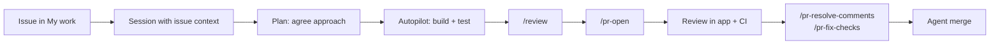

# Lab: GitHub Copilot App: Zero to Hero

> **Duration:** ~1.5 hours guided (30-min demo + 1-hour follow-along) · ~3 hours self-paced for all 11 exercises | **Level:** Beginner → Intermediate | **Prerequisites:** Active [GitHub Copilot subscription](https://github.com/features/copilot/plans), [Node.js 22+](https://nodejs.org/), [Git](https://github.com/git-guides/install-git), and a **private or internal** GitHub repository

## Objective

In this lab you will **build, review, and ship a Task Manager REST API** using the **GitHub Copilot app** — the agent-native desktop application for directing several AI agents at once.

You won't just chat with one agent. You'll run **parallel sessions on isolated worktrees**, move work through **Plan → Autopilot**, take an **issue to a merged pull request** without leaving the app, build a **canvas** you and the agent share, and set up an **automation** that runs when your laptop is closed.

:::note The Copilot app is evolving fast
Commands, panels, and availability change frequently. Type `/` in the prompt box to see what's available right now, or check the [official docs](https://docs.github.com/copilot/concepts/agents/github-copilot-app) if something looks different.
:::

:::tip Facilitator: running this as a 90-minute session
**Demo (30 min):** Exercise 1 (sidebar tour only), then **3**, **4**, **6.4**, **7**, and **8** — the story arc is direct work → parallel control center → ship it → shared surface. Pre-scaffold the repo, pre-install dependencies, and have a **prebuilt canvas** and a **PR with a failing check** ready.

**Follow-along (60 min):** Have attendees do **Exercises 1, 3, 4, and 6.4** themselves — that's a realistic hour including setup. Exercises 2, 5, 7, 8, 9, 10, and 11 are self-paced afterward.
:::

---

## What You'll Build

A **Task Manager REST API** with:

- Express.js server with CRUD endpoints (`GET`, `POST`, `PUT`, `DELETE`)
- Input validation with Zod and centralized error handling
- Jest test suite plus a GitHub Actions workflow, so pull requests get real CI
- Two features built **simultaneously** in parallel sessions on separate branches
- A feature taken from **GitHub issue to merged PR** inside the app
- A custom **canvas** — a shared UI surface you and the agent both drive

### Why the app, specifically?

Copilot is in your IDE, your terminal, on GitHub.com, and in this app. They overlap. The honest framing isn't "the app does things nothing else can" — it's that the app is the **dedicated control center** for running many local and cloud sessions and managing GitHub work, without assembling that yourself from an editor, a terminal, and six browser tabs.

| Capability | IDE | Copilot CLI | Copilot App |
|-----------|-----|-------------|-------------|
| Inline code completion | ✅ | ❌ | ❌ |
| Single agent session | ✅ | ✅ | ✅ |
| Built-in worktree creation + visual session switching | ⚠️ manual | ⚠️ manual | ✅ |
| Launch cloud agent work that outlives your client | ✅ | ✅ | ✅ |
| Unified control center for local **and** cloud sessions | ⚠️ partial | ❌ | ✅ |
| Issue → session → PR → merge in one surface | ⚠️ extensions | ⚠️ partial | ✅ |
| Custom bidirectional canvases | ❌ | ❌ | ✅ |
| Visual automation management | ❌ | ❌ | ✅ |

The app is built on Copilot CLI, so everything you know from the CLI still works.

## Exercise 1 — Install, Sign In, and Orient

### 1.1 Install the App

Download the app for macOS, Windows, or Linux from the [GitHub Copilot app page](https://github.com/features/ai/github-app), then open it.

:::note Business and Enterprise users
The **GitHub Copilot app policy** must be enabled for your organization. It's on by default, and it is *separate* from the Copilot CLI policy. If sign-in is refused, check that first.
:::

### 1.2 Sign In

1. Click **Sign in to GitHub** and complete the browser OAuth flow.
2. For GitHub Enterprise Server, choose **Use GitHub Enterprise** and enter your server address.
3. Pick a theme and finish onboarding.

### 1.3 Create the Lab Repository

Create a new GitHub repository named `task-manager-api`. Two settings matter:

| Setting | Value | Why |
|---------|-------|-----|
| **Visibility** | **Private** or **Internal** | Automations (Exercise 10) are **not available in public repos** |
| **Initialize with a README** | ✅ Yes | A repo with no commits has no default branch, which breaks worktrees and PR targeting |

:::warning Don't improvise these two settings
A public repo blocks Exercise 10 entirely. An empty repo makes Exercises 3, 4, and 7 fragile. Fixing either later means recreating the repo.
:::

### 1.4 Connect the Project

Click **+** in the sidebar next to **Sessions**. Under **Add project from**, you can choose a **local folder**, a **GitHub repository**, or any **repository URL** (Azure DevOps, GitLab, self-hosted).

Choose **GitHub repository** and pick `task-manager-api`.

### 1.5 Learn the Sidebar

Every exercise below lives in one of these. Click through each:

| Area | What's there |
|------|--------------|
| **My work** | Your issues and PRs, with CI status and reviews inline |
| **Sessions** | Active agent sessions grouped by project — your parallel-work control center |
| **Chats** | Conversations that *don't* create a branch or worktree |
| **Automations** | Agent tasks that run on a schedule, on an event, or on demand |
| **Customize** | Plugins, skills, MCP servers, and canvases |
| **Search** | Search across connected repositories |

### 1.6 Your First Session

Click **+** next to **Sessions**, choose your project, and leave the runtime on **New working tree**. Below the prompt field set **Session mode** to `Interactive`, **Model** to `Auto`, and **Reasoning effort** to `Medium`. Then prompt:

```text
Describe this repository: what's in it, what tooling it uses, and what you'd need to build a Node.js REST API here.
```

The repo has only a README, so it should say roughly that — your first signal it's reading files rather than guessing.

### 1.7 Name the Session

```text
/rename scaffold
```

Sessions get auto-generated names. Naming them matters the moment you have five in the sidebar.

### ✅ Checkpoint

The app is installed and authenticated, and a **private** repo **initialized with a README** is connected as a project with one named session running in its own worktree.

## Exercise 2 — Chats vs. Sessions

A common mistake is starting a full session — creating a branch and a worktree — just to ask a question. **Chats** exist for that.

### 2.1 Open a Chat

Click **Chats** in the sidebar and start a conversation. Notice: no branch, no worktree, no diff pane.

### 2.2 Scope the Work Before Any Code Exists

```text
I'm about to build a Task Manager REST API in Node.js with Express and Zod, storing tasks in memory.

Before I write any code, help me pin down:
1. The resource shape for a task (fields, types, constraints)
2. The full endpoint list including filtering and stats
3. Which validation and error-handling patterns to standardize up front
4. What the test strategy should be

Ask me clarifying questions. Don't write code yet.
```

Iterate until the design feels right. **This is cheap thinking.**

### 2.3 Carry the Decision Into a Session

```text
Summarize our agreed design as a concise implementation brief I can paste into a coding session. Include the task schema, endpoint list, validation rules, and test expectations.
```

Copy that brief — you'll use it in Exercise 3.

### 2.4 Know Which to Reach For

| Use | Reach for |
|-----|-----------|
| "How should I model this?" | **Chat** |
| "Explain how this repo's auth works" | **Chat** |
| "Implement the thing we agreed on" | **Session** |
| "Fix this failing test" | **Session** |
| "Pick up issue #42" | **Session** started from the issue |

Chats keep your Sessions list clean, avoid throwaway branches, and cut credit burn by clarifying requirements *before* an agent starts writing files.

**Archive, don't delete.** Right-click a chat and choose **Archive chat** to keep history without clutter. **Settings → Sessions → Manage sessions** lets you search, bulk-archive, and see each session's disk usage.

### ✅ Checkpoint

You can explain the Chats/Sessions split and have an implementation brief ready to hand to an agent.

## Exercise 3 — Scaffold with Plan Mode

Now use the mode ladder that defines app workflow: **Plan** to agree on the approach, then **Autopilot** to execute it.

### 3.1 The Three Session Modes

| Mode | Who drives | Use when |
|------|-----------|----------|
| **Interactive** | You and the agent together | Tight steering, unfamiliar or risky code |
| **Plan** | Agent proposes, **you approve before execution** | Scope is fuzzy or the change is large |
| **Autopilot** | Agent works autonomously | The task is well defined and verifiable |

Switch anytime with the dropdown or `/interactive`, `/plan`, `/autopilot`.

### 3.2 Enter Plan Mode

Return to your `scaffold` session, type `/plan`, and paste your brief from Exercise 2. If you skipped it, use this:

```text
Create a Node.js REST API project for a task manager in this repository.

- Express.js server, entry point src/index.js, port 3000
- Zod for validation
- src/routes/tasks.js with full CRUD: GET /tasks, GET /tasks/:id, POST /tasks, PUT /tasks/:id, DELETE /tasks/:id
- src/middleware/errorHandler.js for centralized error handling with an AppError pattern
- In-memory array as the data store, no database
- A task has: id (uuid), title (string, 1-100 chars, required), description (optional, max 500), status (enum: todo | in-progress | done, defaults to todo), createdAt
- Jest + supertest, with tests for happy paths and validation failures
- A GitHub Actions workflow at .github/workflows/test.yml running npm ci and npm test on every pull request
- package.json scripts: start, dev, test
- A Node.js .gitignore

Plan the work. Do not execute yet.
```

:::note The CI workflow is required
`.github/workflows/test.yml` is what gives your pull requests real check runs. **Exercise 7 depends on it.** Don't let it get dropped from the plan.
:::

### 3.3 Actually Read the Plan

The agent produces a step-by-step plan. **This is the highest-leverage minute in the lab.** Is the file structure right? Are dependencies sensible? Is the workflow there? Push back before approving:

```text
Two changes before we execute:
1. Add request logging middleware that logs method, URL, status, and response time.
2. Add a GET /health endpoint returning status, uptime, and version from package.json.
Update the plan.
```

### 3.4 Approve and Run on Autopilot

Approve, and let the session continue in **Autopilot**. It creates the structure, installs dependencies, writes tests, then runs and fixes them until green.

**About approvals.** Autopilot may still ask permission for some tools. `/allow-all-tools` (aliased `/yolo`) enables auto-approval — use it while you're watching. `/reset-allowed-tools` clears session approvals and turns auto-approval back off.

### 3.5 Verify the Scaffold

Click **Changes** above the prompt box to see the full diff. Then open a terminal *inside the app*:

```text
/terminal npm start
```

```text
/terminal curl -s -X POST http://localhost:3000/tasks -H "Content-Type: application/json" -d '{"title":"Learn the Copilot app"}'
```

`/terminal` isn't a shell-out — it's a canvas in the side panel, your first taste of Exercise 8.

### 3.6 Merge the Scaffold to `main`

**Required before Exercise 4.** Your scaffold lives on this session's branch. Exercise 4 creates sessions that branch from `main`, which currently holds only a README.

```text
/pr-open
```

```text
/pr-merge
```

:::warning Confirm before continuing
This is the most common place to get stuck. Verify on GitHub that `main` now contains `src/routes/tasks.js` and `.github/workflows/test.yml`.
:::

### ✅ Checkpoint

A working, tested Express API is **merged into `main`** with a CI workflow, and you can switch modes and reset tool permissions.

## Exercise 4 — Parallel Sessions

Everything so far you could have done in the CLI or an IDE. This is where the app earns its place.

### 4.1 The Problem This Solves

A single session is a queue: you ask, it works, you wait. Real work isn't a queue — you have a feature to build, a flaky test to chase, and a docs update a week overdue. The app gives every session its **own git worktree and branch**, so agents work in the same repo simultaneously without touching each other's files.

### 4.2 Where a Session Runs

The dropdown under the prompt box offers three runtimes:

| Runtime | Executes on | Survives machine sleep? |
|---------|------------|------------------------|
| **New working tree** | Your machine, isolated worktree + branch | ❌ |
| **Local repository** | Your machine, existing checkout and branch | ❌ |
| **Cloud sandbox** (preview) | GitHub-hosted environment | ✅ |

:::note Three things that sound alike
Customers conflate these constantly:

- **Cloud sandbox** — a *session runtime*; the session itself runs on GitHub.
- **Cloud agent** — asynchronous work in a GitHub Actions environment, launched from GitHub.com, an IDE, an issue, or an automation. **Not app-exclusive.**
- **Remote control** (`/remote`) — the session stays **on your machine**; GitHub.com only *steers* it. If your laptop sleeps, work stops.

Only the first two keep running when your machine is off.
:::

### 4.3 Launch Three Sessions at Once

Create three sessions from **+**, each in a **new working tree**, each named with `/rename`.

**Session A — "filtering"** *(Interactive)*

```text
Add query-parameter filtering to GET /tasks:
- ?status=todo|in-progress|done
- ?q=<text> for case-insensitive search across title and description
- ?sort=createdAt|title and ?order=asc|desc
Validate query params with Zod and return 400 on invalid values. Add tests for each filter.
```

**Session B — "stats"** *(Autopilot)*

```text
Add GET /tasks/stats returning:
{ total, byStatus: { todo, inProgress, done }, oldest, newest, completionRate }
completionRate is done/total as a percentage rounded to one decimal, 0 when total is 0.
Register this route BEFORE the existing GET /tasks/:id route, otherwise /tasks/:id will match "stats" as an id.
Add tests including the empty-store edge case. Follow existing code conventions.
```

**Session C — "docs"** *(Interactive)*

```text
Generate a comprehensive README.md: description, setup, every endpoint with request/response examples and curl commands, error format, and how to run tests. Read the actual route files — don't invent endpoints.
```

If a session reports an empty repository, its base branch is wrong — you skipped merging the scaffold in Exercise 3.6.

### 4.4 Watch Them Run Concurrently

Click between the three. Each has its own branch, worktree, transcript, context window, diff, model, and reasoning effort. Session B keeps working while you steer Session A. **That's the point** — your attention becomes the scarce resource, not agent throughput.

**Match model to task.** Set Session C (docs) to a lighter, faster model and Session A (validation logic) to a higher-capability one. Per-session model selection is one of the quietest cost-saving features in the app.

### 4.5 Land Them Independently

Each session opens its own pull request with `/pr-open`.

:::note What isolation does and doesn't buy you
**The app isolates execution; Git still arbitrates integration.** Separate worktrees stop agents overwriting each other's files. They do *not* prevent merge conflicts — if filtering and stats both touch `src/routes/tasks.js`, the second PR may still need a rebase.
:::

### 4.6 Clean Up

Go to **Settings → Sessions → Manage sessions** to filter, check disk usage, and archive what you're done with. Every session is real disk space, and stale worktrees accumulate fast.

### ✅ Checkpoint

You ran three agents concurrently on isolated branches with different models and modes, and can explain cloud sandbox vs. cloud agent vs. remote control.

## Exercise 5 — From Issue to Session

Most real work starts with an issue, not a blank prompt. The app makes the issue the entry point.

### 5.1 Explore "My work"

Click **My work**. Issues and PRs appear grouped into sections — **All**, **Active**, **Review requests**, **Done**. Try searching inside a section with a qualifier like `label:bug` or `is:open author:@me`, then add your own section with a custom filter.

A section filtered to `review-requested:@me is:open` turns My work into a real triage dashboard, with CI status inline.

### 5.2 Have the Agent File an Issue

In any session:

```text
Create an issue in this repository proposing bulk operations for the task API:
- POST /tasks/bulk to create multiple tasks
- DELETE /tasks/bulk to delete by an array of ids
- PATCH /tasks/bulk/status to update status on multiple tasks
Include acceptance criteria, validation rules, and edge cases (partial failures, empty arrays, unknown ids).
```

The agent picks a repository issue template appropriate to the type. Name a specific template in your prompt to force one.

### 5.3 Start a Session From the Issue

Open the issue in **My work** and click **New session** — the session opens **with the issue context already loaded**. You paste nothing. Set mode to **Plan** and prompt:

```text
Implement this issue. Plan first, and call out anything in the acceptance criteria that's ambiguous or that you'd push back on.
```

### 5.4 Preserve the Reasoning

Review the plan against the acceptance criteria, refine, then approve and let it build. Once it's working:

```text
Attach your implementation plan to this issue as an artifact so reviewers can see the approach before they read the diff.
```

Small habit, outsized payoff: the *why* lives where stakeholders already look instead of evaporating with your session transcript.

### 5.5 Open the PR — and Leave It Open

```text
/pr-open
```

**Don't merge this one.** Exercise 7 uses it.

### ✅ Checkpoint

You filed an issue from an agent, launched a session from it with context preloaded, attached the plan back, and have a PR waiting.

## Exercise 6 — Break It, Then Catch It

The app ships several review agents. They aren't redundant — each looks for something different.

### 6.1 `/review` — General Code Review

In the session with your bulk-operations changes:

```text
/review
```

Reviews the **current session's changes** for bugs and logic errors, ignoring style noise.

### 6.2 `/security-review` — Vulnerability-Focused

```text
/security-review
```

Public preview. Returns **prioritized findings with severity and confidence scores** plus suggested fixes. Requires an active session **with changes**. This is a *pre-PR* check that complements, not replaces, code scanning and Dependabot.

### 6.3 `/rubber-duck` and `/spar` — Independent Opinions

```text
/rubber-duck Critique my bulk operations implementation. Focus on partial-failure semantics.
```

`/rubber-duck` runs on a **different model than your session**, so you get independent judgment rather than a model agreeing with itself. It requires the main agent to be on a Claude or GPT model — switch with `/model` if unavailable.

```text
/spar We're storing tasks in memory and shipping bulk endpoints with no rate limiting. Argue why that's a mistake.
```

`/spar` challenges your approach. Use it on design decisions, not line-level code.

### 6.4 Seed a Real Bug and Catch It

```text
In src/routes/tasks.js, change the DELETE route to use findIndex but remove the check for -1 before calling splice. Make only that change and do not fix it.
```

Start the server, create two tasks, then delete one that doesn't exist:

```text
/terminal npm start
```

```text
/terminal curl -s -X POST http://localhost:3000/tasks -H "Content-Type: application/json" -d '{"title":"Task 1"}'
```

```text
/terminal curl -s -X DELETE http://localhost:3000/tasks/does-not-exist && curl -s http://localhost:3000/tasks
```

No error, no crash — but **a real task is gone**. When `findIndex` returns `-1`, `splice(-1, 1)` removes the *last* element. Exactly the class of bug that survives a casual eyeball review. Now run:

```text
/review
```

:::note If `/review` misses it
Model output isn't deterministic. Narrow the ask: `/review Look specifically at the DELETE handler's index handling.` That's a useful lesson — targeted review prompts beat broad ones.
:::

Apply the fix.

### 6.5 Compare the Reviewers

| Command | Looks for |
|---------|----------|
| `/review` | Bugs and logic errors in current changes |
| `/security-review` | Exploitable vulnerabilities, ranked by severity |
| `/rubber-duck` | Design critique from a *different* model |
| `/spar` | Adversarial challenge to your reasoning |

### ✅ Checkpoint

You know what each review agent is for, and you caught a subtle bug before it reached a pull request.

## Exercise 7 — The Pull Request Lifecycle

Here the app collapses three tools into one: diff to merged without opening a browser.

### 7.1 Create Real Review and CI Context

`/pr-resolve-comments` and `/pr-fix-checks` are **context-gated** — they only appear when unresolved comments or failing checks actually exist. Create them deliberately.

**Make a check fail.** In the session holding your open PR from Exercise 5.5:

```text
Add a test to the bulk operations test file asserting that POST /tasks/bulk rejects an empty array with a 400. Do not change the route implementation — I want this test to fail. Commit and push it.
```

Your workflow from Exercise 3 now runs and goes red.

**Leave unresolved comments.** Open the PR in **My work** → **Files changed** and leave two inline review comments, submitted as **Comment** (not Approve):

> This doesn't validate that the array is non-empty. What happens with `[]`?

> Partial failures aren't handled — if one id is unknown, does the whole request fail?

:::note Working solo is fine
You can leave review comments on your own PR. GitHub only stops you from **approving** it. That's all `/pr-resolve-comments` needs.
:::

### 7.2 Review the PR in the App

Click the PR in **My work**. You get the overview with **CI check results**, a **Files changed** diff, and a **New session** button scoped to that PR. Start one and ask:

```text
Review this pull request as a senior engineer. Focus on correctness and API contract consistency with the existing endpoints. Flag anything that would break existing clients.
```

Comments you draft in a session are **staged into your pending review** — nothing reaches GitHub until you submit with **Review**.

### 7.3 Resolve the Feedback

```text
/pr-resolve-comments
```

:::note Replies land in the thread
The agent's reply goes **into the review thread**, under the reviewer's comment — not as a disconnected top-level PR comment. That's a real difference from pasting a summary at the bottom.
:::

### 7.4 Fix the Failing CI

```text
/pr-fix-checks
```

The agent reads the failure output, diagnoses it, and pushes a fix — here, the empty-array validation your seeded test demanded.

### 7.5 Merge

```text
/pr-merge
```

Or enable **agent merge** at the top of the app. It prompts a session to read the PR, fix what's blocking it (comments, checks, conflicts), and merge as soon as GitHub allows. It **runs in the background, survives app restarts, and switches itself off once merged.**

### 7.6 The Full Loop



### ✅ Checkpoint

You created real review and CI context, then opened, reviewed, revised, unblocked, and merged a PR without leaving the app.

## Exercise 8 — Build a Canvas

If parallel sessions are the app's most *useful* feature, canvases are its most *distinctive*. Nothing else in the Copilot family has this.

### 8.1 What a Canvas Is

Chat is good for defining intent, but most real work happens in a **work surface**: a terminal, a document, a board. A canvas is that surface in the app's side panel, and it's **bidirectional** — the agent updates it while working, you edit it directly, and the agent continues *from your edits*.

You've already used two: `/terminal` opens a terminal canvas, and viewing a markdown artifact opens an editor canvas.

### 8.2 Browse What Exists

Go to **Customize → Canvas** and browse the featured list, then click **Installed**.

Opening a prebuilt canvas takes seconds and shows the concept immediately. Building one takes minutes. Do them in that order — especially when demoing.

### 8.3 Create Your Own

In an active session:

```text
/create-canvas Create an agentic kanban board for this repository's tasks.

People should be able to:
- Add a card with a title, description, and status
- Move cards between columns (Todo, In Progress, Done)
- Filter cards by status and by text search

The agent should be able to call:
- get_board to read current state
- add_card to create a card
- move_card to change a card's status
- summarize_board to report progress

Persist the board state so it survives a restart. Scope it to the project.
```

Choose the scope when prompted:

| Scope | Location | Use for |
|-------|----------|---------|
| **Project** | `.github/extensions` | Team-shared, committed to the repo |
| **User** | `~/.copilot/extensions` | Personal, on your machine |

This takes a few minutes — the agent generates extension files, installs dependencies, reloads, and renders the UI.

### 8.4 Drive It Both Ways

**You drive:** add a few cards through the UI and move one to In Progress.

**The agent drives:**

```text
Read the board and add a card for every open issue in this repository, in the Todo column.
```

```text
Summarize the board: what's in flight, what's blocked, and what I should pick up next.
```

You're both manipulating the *same state*. You never described the board to the agent, and it never described the board back to you.

### 8.5 Iterate on the Canvas Itself

```text
Add a "Blocked" column, an agent-callable block_card action that takes a reason, and show the blocking reason on the card.
```

A project-scoped canvas is committed, so **your whole team gets it on their next pull**. Other things worth building: an issue triage board, a release checklist the agent ticks off, or an incident timeline.

### ✅ Checkpoint

You built a canvas from a prompt, drove it from both the UI and the agent, and know where it lives and how to share it.

## Exercise 9 — Orchestration

Exercise 4 ran sessions in parallel *by hand*. Orchestration lets an agent create and steer them for you.

Each command below creates sessions and consumes AI credits. Run **9.1**, then use the table in 9.4 as reference.

### 9.1 `/orchestrate` — Coordinate Child Sessions

```text
/orchestrate Split the remaining Task Manager work into independent workstreams and run them in parallel child sessions:
1. Add pagination (?page, ?limit) to GET /tasks with tests
2. Add rate-limiting middleware with tests
Each workstream should end with a pull request. Report back with the PR links.
```

Watch the **Sessions** sidebar — child sessions appear **nested under their creator**. Its defining property is *coordinated child sessions*.

### 9.2 `/spawn` and `/fleet`

```text
/spawn Update the README to document the new pagination and rate-limiting behavior.
```

`/spawn` creates one focused child session. `/fleet` puts multiple agents in parallel on a **single** task and consolidates the result:

```text
/fleet Audit this codebase for missing error handling, missing input validation, and untested code paths. Produce one consolidated prioritized report.
```

### 9.3 `/fork` — Branch Your Conversation

```text
/fork
```

Forks the session at the latest turn into a new worktree, **carrying your conversation history with it**. Try an alternative there:

```text
Rewrite the in-memory store as a repository class with an interface that would let us swap in SQLite later, without changing the route handlers.
```

Like it? `/merge-to-parent`. Don't? Archive the fork — your original was never touched.

Git branches files; `/fork` branches files **and** the agent's accumulated context. There's no real equivalent in IDE chat.

### 9.4 Choosing the Right Tool

| You want to… | Use |
|--------------|-----|
| Run several tasks as coordinated child sessions | `/orchestrate` |
| Hand off one side task | `/spawn` |
| Throw more agents at *one* big task | `/fleet` |
| Try an alternative without losing your current path | `/fork` |
| Ship a big change as reviewable layers | `/pr-stack` |

### ✅ Checkpoint

You've orchestrated child sessions and can articulate which primitive fits which shape of work.

## Exercise 10 — Automations

Sessions require you. **Automations don't.** This turns the app from a tool you use into infrastructure that runs.

### 10.1 Check the Prerequisites

| Requirement | Detail |
|-------------|--------|
| **Private or internal repo** | Automations are **not available in public repositories** |
| **Write access** | Any user with write access can create them |
| **Cloud agent enabled** | For Copilot Business/Enterprise, an **admin must enable the cloud agent policy** |
| **Plan** | Copilot Pro, Pro+, Max, Business, or Enterprise |

:::warning Two different policies, two different defaults
The **Copilot app policy** is enabled by default. The **cloud agent policy** for Business/Enterprise is **not** — an admin must turn it on. Don't assume the second because you observed the first.
:::

If you can't meet these, **read this exercise rather than building it** — the concepts still matter for customer conversations.

### 10.2 Local vs. Cloud

| | Local automation | Cloud automation |
|---|---|---|
| Runs on | Your machine | GitHub-hosted environment |
| Machine must be on | ✅ Yes | ❌ No |
| Custom CRON expressions | ✅ | ❌ fixed trigger types |
| Tool scoping | Session permissions | Explicit **Tools** allow-list |

### 10.3 Create a Daily Triage Automation

Go to **Automations → New automation**. Name it `Daily repo triage`, set the trigger to `Daily` at `08:30`, and enable **Run in the cloud**.

Under **Tools**, select only what the task needs — reading issues and updating labels, **not** pushing code. A **Suggest tools** button proposes tools based on your prompt, but review what it picks.

```text
Triage this repository and report:

1. New issues opened in the last 24 hours — summarize each in one line and suggest labels
2. Open pull requests that are blocked: failing checks, conflicts, or no review after 48 hours
3. Any issue with no activity for 14+ days that looks stale
4. One recommended priority for today, with a one-sentence justification

Keep it under 300 words. Lead with anything needing a decision from me.
```

Select your project, then use the dropdown next to **Create** → **Create and run** to test it immediately.

### 10.4 Trigger Types

| Trigger | Behavior |
|---------|----------|
| **Manual** | Runs only when you press play |
| **Hourly / Daily / Weekly** | Fixed schedules |
| **CRON** | Custom expression, **local only** |
| **Issue** | Issue created, with an optional search filter |
| **Pull request** | PR opened or new commits pushed |

**Add another trigger** fires the automation when *any* trigger occurs. Try an event-driven one:

```text
A new issue was just opened.
1. Classify it as bug, feature, question, or docs, and apply the matching label
2. Check whether it duplicates an existing open issue; if so, link it
3. If it's a bug report missing reproduction steps, environment, or expected vs actual behavior, post a polite comment asking for what's missing
4. Do not close anything and do not modify code
```

### 10.5 What a CSA Needs to Know

These matter more to an enterprise buyer than a second sample automation:

| Topic | Reality |
|-------|---------|
| **Visibility** | An automation is **private to its creator** — even repo admins can't see it. The sessions it starts *are* visible to anyone with repo access. |
| **Billing** | Each run consumes **Actions minutes and AI credits**, billed to the creator. |
| **Least privilege** | The **Tools** allow-list is the main control. Issue labeling shouldn't imply push access. |
| **Prompt injection** | Automations **ignore events from users without write access by default**, so an outside contributor can't drive your agent. |
| **Attribution** | PRs from an automation are attributed to its creator, who therefore **cannot approve them**. |
| **Not versioned** | Definitions live outside your repo — **not in Git**, not code-reviewed, not revertible. |
| **Secrets** | Never put secrets in a prompt; session logs are visible to collaborators. |

Automations inherit the repo's cloud agent configuration: custom instructions, skills, firewall rules, and secrets. If cloud runs fail on dependencies or credentials, ask the agent to set up `copilot-setup-steps.yml` for you.

### ✅ Checkpoint

You know the real prerequisites, the local/cloud split, and the visibility, billing, and security facts that come up in every enterprise conversation.

## Exercise 11 — Customize and Session Intelligence

The app inherits the entire Copilot CLI customization ecosystem. **The app-specific value is the visual management UI**, not the underlying mechanisms.

### 11.1 Everything Carries Over

MCP servers and skills already configured for your repos or for Copilot CLI are **automatically available**. Confirm under **Customize → Installed**.

Skills, custom agents, hooks, and MCP authoring are covered in the [Copilot Customization Workshop](/workshops/copilot-customization) and the [Copilot CLI lab](/labs/copilot-cli-zero-to-hero).

### 11.2 Instruction Layers

Beyond the standard repo files, the app adds two settings-based layers. Set a global one under **Settings → Sessions → App instructions**:

```text
Always explain the "why" behind a change, not just the "what".
Prefer small, reviewable diffs. If a change exceeds ~300 lines, propose splitting it.
Never commit secrets, and flag any credential-shaped string you encounter.
```

| Layer | Scope | Shared with team? |
|-------|-------|-------------------|
| App instructions (settings) | Every session, every project | ❌ |
| Project instructions (settings) | One repository | ❌ |
| `.github/copilot-instructions.md` | Repository-wide | ✅ committed |
| `.github/instructions/**/*.instructions.md` | Path-scoped via `applyTo` | ✅ committed |
| `AGENTS.md` | Agent-facing repo instructions | ✅ committed |

Generate the committed one with `/init`, then verify it took hold:

```text
Add a PATCH /tasks/:id/status endpoint that only updates status. Follow the project conventions.
```

### 11.3 Discover Tools

**Customize → Plugins** and **Customize → MCP** let you browse trending servers by category. Enterprises can add a **custom marketplace** — any GitHub repo or Git URL hosting marketplace metadata — which is the realistic path to distributing internal, approved tooling.

```text
/af I need something to query a Postgres database from an agent session
```

Plugin and MCP availability varies by enterprise policy, and many servers need their own authentication. Installation delays are the most common way a group session falls behind.

You can also bring your own model (public preview) under **Settings → Model providers** — OpenAI, Azure OpenAI, Anthropic, Ollama, LM Studio, and any OpenAI-compatible endpoint. Credentials are stored in the system credential store.

### 11.4 Enterprise Governance

Worth knowing if you field admin questions. Enterprises can control which actions users may take — including **which plugins users can install** and **whether auto-approval (`/yolo`) is permitted** — through **enterprise managed settings**, deployed three ways:

| Method | Where |
|--------|-------|
| Server-managed | `.github-private/copilot/managed-settings.json` |
| File-based | macOS `/Library/Application Support/GitHubCopilot/` · Windows `%ProgramFiles%\GitHubCopilot\` · Linux `/etc/github-copilot/` |
| MDM-managed | Native policy values, not a deployed JSON file |

A separate `remoteControl` managed setting applies on top of the remote-control policy in 11.7, per device.

### 11.5 Deep Links

You can launch the app into a specific repo, issue, PR, or a new session from a link, which is how you embed Copilot into runbooks and ticketing systems. App links use the `ghapp://` scheme — for example `ghapp://github.com/OWNER/REPO/issues/NUMBER`, or `ghapp://session/new?repo=OWNER%2FREPO&mode=plan&prompt=...`.

```text
Generate a GitHub Copilot app deep link that opens a new plan-mode session in this repository with a kickoff prompt of "Investigate failing tests". Give me the fully encoded launcher URL.
```

Deep links open a **confirmation UI** — they don't silently create sessions. Never put secrets in one; URLs land in browser history and server logs.

### 11.6 Mine Your Session History

The app is built on Copilot CLI, so your sessions land in the same searchable history:

```text
/chronicle standup
```

```text
/chronicle cost-tips
```

```text
/chronicle improve
```

`/chronicle improve` suggests changes to your instructions file based on what you keep correcting manually. If you repeat the same feedback to agents, run it.

### 11.7 Remote Control

```text
/remote
```

Lets you monitor and steer the current session from **GitHub.com or GitHub Mobile**.

:::warning Remote control does not mean "runs in the cloud"
The most commonly misunderstood feature in the app:

- **The session still runs on your machine.** Every command executes locally.
- **Your machine must stay online.** If it sleeps or loses connectivity, remote control is unavailable until it's back.
- **Slash commands don't work remotely.** You can prompt, approve, switch modes, and cancel — that's it.
- An org owner must set the "Store local sessions in the Cloud" policy to **View and control**. It's unconfigured by default.

If you need work that survives a closed laptop, you want a cloud sandbox or a cloud automation.
:::

### 11.8 Context and Cost

Use `/context` to see usage, `/compact` to relieve token pressure, and `/usage` for plan limits. **The single most effective cost habit:** start a new session when you switch tasks, so you stop paying to carry irrelevant history.

### ✅ Checkpoint

You know what the Customize UI adds, how instruction layers stack, how to mine session history, and precisely what remote control does and doesn't do.

## Quick Reference

### Session Modes

| Mode | Command | Autonomy |
|------|---------|----------|
| Interactive | `/interactive` | Agent proposes, waits for you |
| Plan | `/plan` | Agent plans, you approve, then it executes |
| Autopilot | `/autopilot` | Fully autonomous |

### Essential Slash Commands

| Command | Purpose |
|---------|---------|
| `/model`, `/models` | Select model (including BYOK and `Auto`) |
| `/agent` | Select a custom agent |
| `/review` | Review the current session's changes |
| `/security-review` | Security-focused review of current diffs |
| `/rubber-duck` | Critique from a different model |
| `/spar` | Adversarial challenge to your approach |
| `/pr-open` | Open a PR from session changes |
| `/pr-resolve-comments` | Work through unresolved review comments |
| `/pr-fix-checks` | Address failing PR checks |
| `/pr-merge` | Merge the current PR |
| `/pr-stack` | Create a stack of dependent PRs (built-in skill) |
| `/orchestrate` | Coordinate work across child sessions |
| `/spawn` | Create a focused child session |
| `/fleet` | Multiple agents in parallel on one task |
| `/fork`, `/merge-to-parent` | Fork a session and merge it back |
| `/create-canvas` | Build a canvas extension |
| `/terminal [cmd]` | Open a terminal canvas |
| `/inbox` | Render the interactive inbox widget |
| `/init` | Generate or improve repository instructions |
| `/skills` | Manage skills (`/skills reload` mid-session) |
| `/af` | Find installable MCP servers, tools, skills, agents |
| `/chronicle` | History, standup, cost tips, instruction improvements |
| `/remote` | Steer this session from GitHub.com or GitHub Mobile |
| `/research` | Run a research workflow and produce a cited report |
| `/allow-all-tools`, `/reset-allowed-tools` | Toggle and clear tool auto-approval |
| `/context`, `/compact`, `/usage` | Context and cost management |
| `/rename`, `/clear`, `/restart-session` | Session housekeeping |
| `/export-gist` | Export the transcript to a secret gist |
| `/attach-files`, `/attach-folder` | Attach context to a message |

:::note Many commands are context-gated
Commands appear only when their context exists — an active session, session changes, an open PR. Type `/` to see what's valid right now.
:::

### Prompt Box Shortcuts

| Symbol | Does |
|--------|------|
| `#` | Reference an issue |
| `@` | Add a file to context |
| `/` | Open the command picker |

### Customization Locations

| Item | Project scope | User scope |
|------|--------------|-----------|
| Canvas extensions | `.github/extensions` | `~/.copilot/extensions` |
| Skills | `.github/skills/<name>/SKILL.md` | `~/.copilot/skills/<name>/SKILL.md` |
| Custom agents | `.github/agents/<name>.agent.md` | `~/.copilot/agents/<name>.agent.md` |

## Related Resources

- [About the GitHub Copilot app](https://docs.github.com/en/copilot/concepts/agents/github-copilot-app)
- [Getting started with the GitHub Copilot app](https://docs.github.com/en/copilot/get-started/quickstart-copilot-app)
- [Working with agent sessions](https://docs.github.com/en/copilot/how-tos/github-copilot-app/agent-sessions)
- [Working with canvas extensions](https://docs.github.com/en/copilot/how-tos/github-copilot-app/working-with-canvas-extensions)
- [Managing issues and pull requests](https://docs.github.com/en/copilot/how-tos/github-copilot-app/managing-issues-and-pull-requests)
- [Using automations in the app](https://docs.github.com/en/copilot/how-tos/github-copilot-app/using-automations)
- [About Copilot automations](https://docs.github.com/en/copilot/concepts/agents/cloud-agent/about-automations)
- [About remote control of Copilot CLI sessions](https://docs.github.com/en/copilot/concepts/agents/copilot-cli/about-remote-control)
- [Slash commands reference](https://docs.github.com/en/copilot/reference/github-copilot-app-reference/slash-commands)
- [Built-in skills reference](https://docs.github.com/en/copilot/reference/github-copilot-app-reference/built-in-skills)
- [Deep links reference](https://docs.github.com/en/copilot/how-tos/github-copilot-app/open-with-deep-links)
- [Using your own LLM models (BYOK)](https://docs.github.com/en/copilot/how-tos/github-copilot-app/use-byok-models)
- [Companion lab: Copilot CLI: Zero to Hero](/labs/copilot-cli-zero-to-hero)
