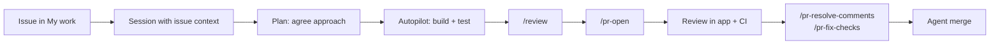

# Lab: GitHub Copilot App: Zero to Hero

> **Duration:** 30-minute demo + 1 hour hands-on | **Level:** Beginner → Intermediate | **Prerequisites:** Active [GitHub Copilot subscription](https://github.com/features/copilot/plans), [Node.js 22+](https://nodejs.org/), [Git](https://github.com/git-guides/install-git), and a **private or internal** GitHub repository

## Objective

The **GitHub Copilot app** is the agent-native desktop application for directing several AI agents at once. This lab covers it in two parts.

**Part 1** is a 30-minute demo of what the app does that your IDE and terminal don't. It opens by handing an agent an entire API to build, then — instead of watching it work — starts a second agent building something else alongside it. The rest of the demo happens while both are running, which is the argument in miniature: bidirectional canvases, agents spawning their own agents, and automations that run with nobody in the room.

**Part 2** is an hour at your own keyboard, building and shipping a **Task Manager REST API** — Plan mode to Autopilot, three agents at once, an issue taken to a merged pull request, all inside the app.

:::note The Copilot app is evolving fast
Commands, panels, and availability change frequently. Type `/` in the prompt box to see what's available right now, or check the [official docs](https://docs.github.com/copilot/concepts/agents/github-copilot-app) if something looks different.
:::

:::tip Self-paced? Skim Part 1, then work Part 2
Part 1 is self-contained — it builds its own scaffold, so you *can* run it end to end. But it moves fast on purpose, and Part 2 builds the same API more slowly with the reasoning spelled out. Skim Part 1 to see where you're going, then work Part 2 properly. If you do run Part 1 yourself, you'll have already covered Part 2's Exercise 2 and can skim it.
:::

---

## What You'll Build

A **Task Manager REST API** with:

- Express.js server with CRUD endpoints (`GET`, `POST`, `PUT`, `DELETE`)
- Input validation with Zod and centralized error handling
- Jest test suite plus a GitHub Actions workflow, so pull requests get real CI
- Two features built **simultaneously** in parallel sessions on separate branches
- A feature taken from **GitHub issue to merged PR** inside the app

### Why the app, specifically?

Copilot is in your IDE, your terminal, on GitHub.com, and in this app. They overlap. The honest framing isn't "the app does things nothing else can" — it's that the app is the **dedicated control center** for running many local and cloud sessions and managing GitHub work, without assembling that yourself from an editor, a terminal, and six browser tabs.

| Capability | IDE | Copilot CLI | Copilot App |
|-----------|-----|-------------|-------------|
| Inline code completion | ✅ | ❌ | ❌ |
| Single agent session | ✅ | ✅ | ✅ |
| Built-in worktree creation + visual session switching | ⚠️ manual | ⚠️ manual | ✅ |
| Launch cloud agent work that outlives your client | ✅ | ✅ | ✅ |
| Unified control center for local **and** cloud sessions | ⚠️ partial | ❌ | ✅ |
| Issue → session → PR → merge in one surface | ⚠️ extensions | ⚠️ partial | ✅ |
| Custom bidirectional canvases | ❌ | ❌ | ✅ |
| Visual automation management | ❌ | ❌ | ✅ |

The app is built on Copilot CLI, so everything you know from the CLI still works.

## Setup (do this before the session) {#setup}

Ten minutes of pre-work. Do it ahead of time — it is the most common reason a group session falls behind.

### S.1 Install and Sign In

Download the app for macOS, Windows, or Linux from the [GitHub Copilot app page](https://github.com/features/ai/github-app), then sign in through the browser OAuth flow. For GitHub Enterprise Server, choose **Use GitHub Enterprise** and enter your server address.

:::note Business and Enterprise users
The **GitHub Copilot app policy** must be enabled for your organization. It's on by default, and it is *separate* from the Copilot CLI policy. If sign-in is refused, check that first.
:::

### S.2 Create the Lab Repository

Create a new GitHub repository named `task-manager-api`. Two settings matter:

| Setting | Value | Why |
|---------|-------|-----|
| **Visibility** | **Private** or **Internal** | Automations are **not available in public repos** |
| **Initialize with a README** | ✅ Yes | A repo with no commits has no default branch, which breaks worktrees and PR targeting |

:::warning Don't improvise these two settings
A public repo blocks the automations demo entirely. An empty repo makes the parallel-session and PR exercises fragile. Fixing either later means recreating the repo.
:::

### S.3 Connect the Project

Click **+** in the sidebar next to **Sessions**. Under **Add project from**, you can choose a **local folder**, a **GitHub repository**, or any **repository URL** (Azure DevOps, GitLab, self-hosted). Choose **GitHub repository** and pick `task-manager-api`.

### S.4 Learn the Sidebar

Click through each area — every exercise in this lab lives in one of them:

| Area | What's there |
|------|--------------|
| **My work** | Your issues and PRs, with CI status and reviews inline |
| **Sessions** | Active agent sessions grouped by project — your parallel-work control center |
| **Chats** | Conversations that *don't* create a branch or worktree |
| **Automations** | Agent tasks that run on a schedule, on an event, or on demand |
| **Customize** | Plugins, skills, MCP servers, and canvases |
| **Search** | Search across connected repositories |

### ✅ Checkpoint

The app is installed and authenticated, and a **private** repo **initialized with a README** is connected as a project.

---

# Part 1 — The 30-Minute Demo

Six segments, thirty minutes. The demo doesn't *describe* parallel agents — it runs on them. You start a build in the first two minutes and never sit watching a progress bar, because there's always a second agent working while you talk.

:::tip Facilitator prep
The scaffold is built live, so there's no pre-built repo to prepare — but there *is* a prepared session, because a live build is the one thing in this demo that can run long.

The day before, or an hour before:

1. Connect an **empty private repo** (README only) as a project.
2. **Run Demo 1's prompt end to end yourself**, in a session you `/rename` to `scaffold-prepared`. Let it finish green. **Do not merge it** — leave the PR unopened so `main` still holds only the README.
3. Leave that session in the sidebar. It warms the npm cache for the live run *and* becomes your safety net in Demo 4.
4. Create the **Daily repo triage** automation from Demo 6 and **run it once**, so you have real output to show instead of an empty history.

That's it. Roughly fifteen minutes of prep for a thirty-minute demo.
:::

## Demo 1 — Start the Build, Then Walk Away (~4 min)

Open a new session on a **new working tree**, `/rename` it to `scaffold-live` so it's never confused with your prepared one, set mode to **Plan**, and give it the whole job at once:

```text
Create a Node.js REST API project for a task manager in this repository.

- Express.js server, entry point src/index.js, port 3000
- Zod for validation
- src/routes/tasks.js with full CRUD: GET /tasks, GET /tasks/:id, POST /tasks, PUT /tasks/:id, DELETE /tasks/:id
- src/middleware/errorHandler.js for centralized error handling with an AppError pattern
- In-memory array as the data store, no database
- A task has: id (uuid), title (string, 1-100 chars, required), description (optional, max 500), status (enum: todo | in-progress | done, defaults to todo), createdAt
- Jest + supertest, with tests for happy paths and validation failures
- A GitHub Actions workflow at .github/workflows/test.yml running npm ci and npm test on every pull request
- package.json scripts: start, dev, test

Plan the work. Do not execute yet.
```

Read the plan out loud — this is the one place worth slowing down, because it's where a human still adds most of the value. Push back on it live so the audience sees the loop is a conversation, not a slot machine:

```text
Add request logging middleware and a GET /health endpoint returning status, uptime, and version. Update the plan.
```

Approve, and switch it to **Autopilot**. It will now install dependencies, write tests, and run them until they pass — several minutes of work.

**Then leave it.** That's the point of the next two segments. In an IDE you would be watching this. Here you're going to go do something else while it runs.

## Demo 2 — Start a Second Agent While the First Works (~6 min)

Open a **second** session, on its own working tree, and give it a completely different job — one that doesn't touch the code being scaffolded:

```text
/create-canvas Create an agentic kanban board for this repository's tasks.

People should be able to add a card with a title, description, and status; move cards between Todo, In Progress, and Done; and filter by status and text.

The agent should be able to call get_board, add_card, move_card, and summarize_board.

Persist the board state so it survives a restart. Scope it to the project.
```

Now click back and forth between the two sessions. **This is the moment the app justifies itself.** Two agents, two branches, two worktrees, two transcripts, two context windows — one repository, no collisions, and neither one is blocked on you.

Worth saying while they run:

- Each session can use a **different model and reasoning effort**. Put the cheap one on scaffolding boilerplate and the expensive one on the work that needs judgment. Per-session model selection is one of the quietest cost-saving features in the app.
- **The app isolates execution; Git still arbitrates integration.** Separate worktrees stop agents overwriting each other's files. They do *not* prevent merge conflicts.
- Your attention is now the scarce resource, not agent throughput.

Then the runtime dropdown, which is where customers get confused:

| Runtime | Executes on | Survives machine sleep? |
|---------|------------|------------------------|
| **New working tree** | Your machine, isolated worktree + branch | ❌ |
| **Local repository** | Your machine, existing checkout and branch | ❌ |
| **Cloud sandbox** (preview) | GitHub-hosted environment | ✅ |

:::note Three things that sound alike
- **Cloud sandbox** — a *session runtime*; the session itself runs on GitHub.
- **Cloud agent** — asynchronous work in a GitHub Actions environment, launched from GitHub.com, an IDE, an issue, or an automation. **Not app-exclusive.**
- **Remote control** (`/remote`) — the session stays **on your machine**; GitHub.com only *steers* it.

Only the first two keep running when your machine is off.
:::

## Demo 3 — Tour the Control Center While They Run (~4 min)

Both agents are still working. Use the time.

**Sessions** is the parallel-work control center — sessions grouped by project, switched by clicking. **Chats** sits next to it and creates no branch and no worktree. Starting a full session to ask a question is the most common new-user mistake:

| Use | Reach for |
|-----|-----------|
| "How should I model this?" | **Chat** |
| "Explain how this repo's auth works" | **Chat** |
| "Implement the thing we agreed on" | **Session** |
| "Pick up issue #42" | **Session** started from the issue |

**My work** groups your issues and PRs into **All**, **Active**, **Review requests**, and **Done**, with CI status inline. Add a section filtered to `review-requested:@me is:open` to show it working as a triage dashboard.

Glance back at the sidebar: both sessions have been making progress this entire segment.

## Demo 4 — Collect Both Results (~6 min)

Return to `scaffold-live`. It should be green.

:::tip The prepared-earlier switch
If it's still working, don't stall and don't narrate a progress bar. Click `scaffold-prepared` instead and carry on — same prompt, same repo, already finished. Say so plainly: *"I ran this exact prompt before we started, so we're not going to sit here watching npm install."* Nobody minds the cooking-show move; they mind watching a spinner.

This is also worth doing **even when the live run finishes in time**, if you're running tight. Nothing later in the demo depends on which of the two sessions you merge.

Leave `scaffold-live` running. Coming back at the end to find it green is a decent closing beat, and it makes the point that the session didn't need you.
:::

Verify without leaving the app:

```text
/terminal npm test
```

That terminal is a **canvas** in the side panel, not a shell-out — which is the perfect setup for the other session's output. Merge the scaffold so later segments have code to work with:

```text
/pr-open
```

```text
/pr-merge
```

Now open the kanban canvas the second agent built. Chat is good for defining intent, but most real work happens in a **work surface**: a terminal, a document, a board. A canvas is that surface, and it's **bidirectional**.

Add a card through the UI yourself. Then ask the agent:

```text
Read the board and add a card for every open issue in this repository, in the Todo column. Then summarize what's in flight and what I should pick up next.
```

You never described the board to the agent, and it never described the board back to you. You're both manipulating the same state. Nothing else in the Copilot family has this.

| Scope | Location | Use for |
|-------|----------|---------|
| **Project** | `.github/extensions` | Team-shared, committed to the repo |
| **User** | `~/.copilot/extensions` | Personal, on your machine |

A project-scoped canvas is committed, so **the whole team gets it on their next pull**.

## Demo 5 — Agents Managing Agents (~5 min)

You just ran two sessions in parallel by hand. Orchestration lets an agent do it for you — and now that the scaffold is on `main`, there's real code to work on:

```text
/orchestrate Split the remaining work into independent workstreams and run them in parallel child sessions: pagination on GET /tasks, and rate-limiting middleware. Each should end with a pull request. Report back with the PR links.
```

Child sessions appear **nested under their creator** in the sidebar. Let them run in the background — same trick as Demo 1.

Then `/fork`, which has no real equivalent in IDE chat:

```text
/fork
```

Git branches files. `/fork` branches files **and** the agent's accumulated conversation context, into a new worktree. Explore an alternative there; `/merge-to-parent` if you like it, archive it if you don't. The original was never touched.

| You want to… | Use |
|--------------|-----|
| Run several tasks as coordinated child sessions | `/orchestrate` |
| Hand off one side task | `/spawn` |
| Throw more agents at *one* big task | `/fleet` |
| Try an alternative without losing your current path | `/fork` |
| Ship a big change as reviewable layers | `/pr-stack` |

Each of these creates sessions and consumes AI credits — worth saying out loud to an enterprise audience.

## Demo 6 — Automations and Governance (~5 min)

Every session so far needed you in the room. **Automations don't.** This is where the app stops being a tool you use and becomes infrastructure that runs.

Show the **Daily repo triage** automation you ran before the session, then walk its definition: **Automations → New automation**, a `Daily` trigger, **Run in the cloud** enabled, and a **Tools** allow-list.

```text
Triage this repository and report: new issues in the last 24 hours with suggested labels; open PRs that are blocked by failing checks, conflicts, or no review after 48 hours; anything stale for 14+ days; and one recommended priority for today. Under 300 words, lead with anything needing a decision from me.
```

Triggers are **Manual**, **Hourly / Daily / Weekly**, **CRON** (local only), **Issue**, and **Pull request**. Local automations need your machine on and support custom CRON; cloud automations don't need your machine but use fixed trigger types and an explicit tool allow-list.

The facts that matter to an enterprise buyer, more than a second sample automation:

| Topic | Reality |
|-------|---------|
| **Prerequisites** | Private/internal repo, write access, and for Business/Enterprise an admin-enabled **cloud agent policy** — which is **off** by default, unlike the app policy |
| **Visibility** | An automation is **private to its creator** — even repo admins can't see it. The sessions it starts *are* visible. |
| **Billing** | Each run consumes **Actions minutes and AI credits**, billed to the creator |
| **Least privilege** | The **Tools** allow-list is the main control. Issue labeling shouldn't imply push access. |
| **Prompt injection** | Automations **ignore events from users without write access by default** |
| **Attribution** | PRs are attributed to the creator, who therefore **cannot approve them** |
| **Not versioned** | Definitions live outside your repo — **not in Git**, not code-reviewed, not revertible |

Close on the questions the admin in the room is already forming.

:::warning Remote control does not mean "runs in the cloud"
`/remote` lets you steer a session from GitHub.com or GitHub Mobile, and it is the most commonly misunderstood feature in the app:

- **The session still runs on your machine.** Every command executes locally.
- **Your machine must stay online.** If it sleeps, remote control is unavailable until it's back.
- **Slash commands don't work remotely.** You can prompt, approve, switch modes, and cancel — that's it.
- An org owner must set the "Store local sessions in the Cloud" policy to **View and control**. It's unconfigured by default.

If you need work that survives a closed laptop, you want a cloud sandbox or a cloud automation.
:::

**Enterprise managed settings** control which actions users may take, including which plugins they can install and whether auto-approval (`/yolo`) is permitted, deployed server-managed via `.github-private/copilot/managed-settings.json`, file-based (macOS `/Library/Application Support/GitHubCopilot/`, Windows `%ProgramFiles%\GitHubCopilot\`, Linux `/etc/github-copilot/`), or through MDM. A separate `remoteControl` setting applies per device.

**Deep links** embed the app into runbooks and ticketing systems using the `ghapp://` scheme — for example `ghapp://session/new?repo=OWNER%2FREPO&mode=plan&prompt=...`. They open a confirmation UI rather than silently creating sessions.

**Bring your own model** (public preview) under **Settings → Model providers** supports OpenAI, Azure OpenAI, Anthropic, Ollama, LM Studio, and any OpenAI-compatible endpoint, with credentials in the system credential store.

### ✅ Demo Checkpoint

In thirty minutes the audience watched an API get built, a canvas get built *at the same time*, both land, agents spawn their own agents, and an automation run with nobody in the room. Now hand them the keyboard.

---

# Part 2 — One Hour, Hands On

Six exercises, about an hour total. The demo moved fast and skipped the reasoning; here you build the same API yourself, slowly enough to see why each step is shaped the way it is — scaffold with Plan mode, run three agents on it at once, and take an issue to a merged pull request.

Complete [Setup](#setup) first.

## Exercise 1 — Chats vs. Sessions (~6 min)

Before writing code, use the surface that doesn't create a branch.

### 1.1 Think in a Chat

Click **Chats** and start a conversation. No branch, no worktree, no diff pane.

```text
I'm about to build a Task Manager REST API in Node.js with Express and Zod, storing tasks in memory.

Before I write any code, help me pin down:
1. The resource shape for a task (fields, types, constraints)
2. The full endpoint list including filtering and stats
3. Which validation and error-handling patterns to standardize up front
4. What the test strategy should be

Ask me clarifying questions. Don't write code yet.
```

Iterate until the design feels right. **This is cheap thinking** — you're clarifying requirements before an agent starts burning credits writing files.

### 1.2 Carry the Decision Into a Session

```text
Summarize our agreed design as a concise implementation brief I can paste into a coding session. Include the task schema, endpoint list, validation rules, and test expectations.
```

Copy that brief. You'll use it in Exercise 2.

### 1.3 Start and Name a Session

Click **+** next to **Sessions**, choose your project, and leave the runtime on **New working tree**. Below the prompt field set **Session mode** to `Interactive`, **Model** to `Auto`, and **Reasoning effort** to `Medium`. Then:

```text
/rename scaffold
```

Sessions get auto-generated names. Naming them matters the moment you have five in the sidebar.

**Archive, don't delete.** Right-click a chat or session and choose **Archive**. **Settings → Sessions → Manage sessions** lets you search, bulk-archive, and see each session's disk usage.

### ✅ Checkpoint

You can explain the Chats/Sessions split, and you have an implementation brief and a named session ready.

## Exercise 2 — Scaffold with Plan Mode (~12 min)

Now the mode ladder that defines app workflow: **Plan** to agree on the approach, then **Autopilot** to execute it.

### 2.1 The Three Session Modes

| Mode | Who drives | Use when |
|------|-----------|----------|
| **Interactive** | You and the agent together | Tight steering, unfamiliar or risky code |
| **Plan** | Agent proposes, **you approve before execution** | Scope is fuzzy or the change is large |
| **Autopilot** | Agent works autonomously | The task is well defined and verifiable |

Switch anytime with the dropdown or `/interactive`, `/plan`, `/autopilot`.

### 2.2 Enter Plan Mode

In your `scaffold` session, type `/plan` and paste your brief from Exercise 1. If you skipped it, use this:

```text
Create a Node.js REST API project for a task manager in this repository.

- Express.js server, entry point src/index.js, port 3000
- Zod for validation
- src/routes/tasks.js with full CRUD: GET /tasks, GET /tasks/:id, POST /tasks, PUT /tasks/:id, DELETE /tasks/:id
- src/middleware/errorHandler.js for centralized error handling with an AppError pattern
- In-memory array as the data store, no database
- A task has: id (uuid), title (string, 1-100 chars, required), description (optional, max 500), status (enum: todo | in-progress | done, defaults to todo), createdAt
- Jest + supertest, with tests for happy paths and validation failures
- A GitHub Actions workflow at .github/workflows/test.yml running npm ci and npm test on every pull request
- package.json scripts: start, dev, test
- A Node.js .gitignore

Plan the work. Do not execute yet.
```

:::note The CI workflow is required
`.github/workflows/test.yml` is what gives your pull requests real check runs. **Exercise 6 depends on it.** Don't let it get dropped from the plan.
:::

### 2.3 Actually Read the Plan

**This is the highest-leverage minute in the lab.** Is the file structure right? Are dependencies sensible? Is the workflow there? Push back before approving:

```text
Two changes before we execute:
1. Add request logging middleware that logs method, URL, status, and response time.
2. Add a GET /health endpoint returning status, uptime, and version from package.json.
Update the plan.
```

### 2.4 Approve and Run on Autopilot

Approve, and let the session continue in **Autopilot**. It creates the structure, installs dependencies, writes tests, then runs and fixes them until green.

Autopilot may still ask permission for some tools. `/allow-all-tools` (aliased `/yolo`) enables auto-approval — use it while you're watching. `/reset-allowed-tools` clears session approvals and turns auto-approval back off.

### 2.5 Verify the Scaffold

Click **Changes** above the prompt box to see the full diff, then:

```text
/terminal npm start
```

```text
/terminal curl -s -X POST http://localhost:3000/tasks -H "Content-Type: application/json" -d '{"title":"Learn the Copilot app"}'
```

### 2.6 Merge the Scaffold to `main` {#merge-scaffold}

**Required before Exercise 3.** Your scaffold lives on this session's branch. Exercise 3 creates sessions that branch from `main`, which currently holds only a README.

```text
/pr-open
```

```text
/pr-merge
```

:::warning Confirm before continuing
This is the most common place to get stuck. Verify on GitHub that `main` now contains `src/routes/tasks.js` and `.github/workflows/test.yml`.
:::

### ✅ Checkpoint

A working, tested Express API is **merged into `main`** with a CI workflow.

## Exercise 3 — Three Agents at Once (~13 min)

You watched this in Demo 2. Now run it yourself. Every session gets its **own git worktree and branch**, so agents work in the same repo simultaneously without touching each other's files.

### 3.1 Launch Three Sessions

Create three sessions from **+**, each in a **new working tree**, each named with `/rename`.

**Session A — "filtering"** *(Interactive)*

```text
Add query-parameter filtering to GET /tasks:
- ?status=todo|in-progress|done
- ?q=<text> for case-insensitive search across title and description
- ?sort=createdAt|title and ?order=asc|desc
Validate query params with Zod and return 400 on invalid values. Add tests for each filter.
```

**Session B — "stats"** *(Autopilot)*

```text
Add GET /tasks/stats returning:
{ total, byStatus: { todo, inProgress, done }, oldest, newest, completionRate }
completionRate is done/total as a percentage rounded to one decimal, 0 when total is 0.
Register this route BEFORE the existing GET /tasks/:id route, otherwise /tasks/:id will match "stats" as an id.
Add tests including the empty-store edge case. Follow existing code conventions.
```

**Session C — "docs"** *(Interactive)*

```text
Generate a comprehensive README.md: description, setup, every endpoint with request/response examples and curl commands, error format, and how to run tests. Read the actual route files — don't invent endpoints.
```

If a session reports an empty repository, its base branch is wrong — you skipped [merging the scaffold](#merge-scaffold).

### 3.2 Work Them Concurrently

Click between the three. Each has its own branch, worktree, transcript, context window, diff, model, and reasoning effort. Session B keeps working while you steer Session A.

Set Session C to a lighter, faster model and Session A to a higher-capability one, and watch the difference in speed and cost.

### 3.3 Land Them Independently

Each session opens its own pull request with `/pr-open`. If filtering and stats both touched `src/routes/tasks.js`, the second PR may need a rebase — isolation prevents overwrites, not merge conflicts.

### 3.4 Clean Up

**Settings → Sessions → Manage sessions** shows disk usage per session. Every session is real disk space, and stale worktrees accumulate fast.

### ✅ Checkpoint

You ran three agents concurrently on isolated branches with different models and modes.

## Exercise 4 — From Issue to Session (~10 min)

Most real work starts with an issue, not a blank prompt.

### 4.1 Have the Agent File an Issue

In any session:

```text
Create an issue in this repository proposing bulk operations for the task API:
- POST /tasks/bulk to create multiple tasks
- DELETE /tasks/bulk to delete by an array of ids
- PATCH /tasks/bulk/status to update status on multiple tasks
Include acceptance criteria, validation rules, and edge cases (partial failures, empty arrays, unknown ids).
```

The agent picks a repository issue template appropriate to the type. Name a specific template in your prompt to force one.

### 4.2 Start a Session From the Issue

Open the issue in **My work** and click **New session** — the session opens **with the issue context already loaded**. You paste nothing. Set mode to **Plan**:

```text
Implement this issue. Plan first, and call out anything in the acceptance criteria that's ambiguous or that you'd push back on.
```

### 4.3 Preserve the Reasoning

Review the plan against the acceptance criteria, refine, then approve and let it build. Once it's working:

```text
Attach your implementation plan to this issue as an artifact so reviewers can see the approach before they read the diff.
```

Small habit, outsized payoff: the *why* lives where stakeholders already look instead of evaporating with your session transcript.

### 4.4 Open the PR — and Leave It Open {#leave-pr-open}

```text
/pr-open
```

**Don't merge this one.** Exercise 6 uses it.

### ✅ Checkpoint

You filed an issue from an agent, launched a session from it with context preloaded, attached the plan back, and have a PR waiting.

## Exercise 5 — Break It, Then Catch It (~9 min)

The app ships several review agents. They aren't redundant — each looks for something different.

### 5.1 Seed a Real Bug

In the session with your bulk-operations changes:

```text
In src/routes/tasks.js, change the DELETE route to use findIndex but remove the check for -1 before calling splice. Make only that change and do not fix it.
```

Start the server, create a task, then delete one that doesn't exist:

```text
/terminal npm start
```

```text
/terminal curl -s -X POST http://localhost:3000/tasks -H "Content-Type: application/json" -d '{"title":"Task 1"}'
```

```text
/terminal curl -s -X DELETE http://localhost:3000/tasks/does-not-exist && curl -s http://localhost:3000/tasks
```

No error, no crash — but **a real task is gone**. When `findIndex` returns `-1`, `splice(-1, 1)` removes the *last* element. Exactly the class of bug that survives a casual eyeball review.

### 5.2 Catch It

```text
/review
```

`/review` reviews the **current session's changes** for bugs and logic errors, ignoring style noise.

:::note If `/review` misses it
Model output isn't deterministic. Narrow the ask: `/review Look specifically at the DELETE handler's index handling.` That's a useful lesson — targeted review prompts beat broad ones.
:::

Apply the fix.

### 5.3 The Other Reviewers

```text
/security-review
```

Public preview. Returns **prioritized findings with severity and confidence scores** plus suggested fixes. Requires an active session **with changes**. It's a *pre-PR* check that complements, not replaces, code scanning and Dependabot.

```text
/rubber-duck Critique my bulk operations implementation. Focus on partial-failure semantics.
```

`/rubber-duck` runs on a **different model than your session**, so you get independent judgment rather than a model agreeing with itself. It requires the main agent to be on a Claude or GPT model — switch with `/model` if unavailable.

```text
/spar We're storing tasks in memory and shipping bulk endpoints with no rate limiting. Argue why that's a mistake.
```

| Command | Looks for |
|---------|----------|
| `/review` | Bugs and logic errors in current changes |
| `/security-review` | Exploitable vulnerabilities, ranked by severity |
| `/rubber-duck` | Design critique from a *different* model |
| `/spar` | Adversarial challenge to your reasoning |

### ✅ Checkpoint

You caught a subtle bug before it reached a pull request, and know what each review agent is for.

## Exercise 6 — The Pull Request Lifecycle (~12 min)

Here the app collapses three tools into one: diff to merged without opening a browser.

### 6.1 Create Real Review and CI Context

`/pr-resolve-comments` and `/pr-fix-checks` are **context-gated** — they only appear when unresolved comments or failing checks actually exist. Create them deliberately.

**Make a check fail.** In the session holding your [open PR](#leave-pr-open):

```text
Add a test to the bulk operations test file asserting that POST /tasks/bulk rejects an empty array with a 400. Do not change the route implementation — I want this test to fail. Commit and push it.
```

Your workflow from Exercise 2 now runs and goes red.

**Leave unresolved comments.** Open the PR in **My work** → **Files changed** and leave two inline review comments, submitted as **Comment** (not Approve):

> This doesn't validate that the array is non-empty. What happens with `[]`?

> Partial failures aren't handled — if one id is unknown, does the whole request fail?

:::note Working solo is fine
You can leave review comments on your own PR. GitHub only stops you from **approving** it. That's all `/pr-resolve-comments` needs.
:::

### 6.2 Review the PR in the App

Click the PR in **My work**. You get the overview with **CI check results**, a **Files changed** diff, and a **New session** button scoped to that PR. Start one and ask:

```text
Review this pull request as a senior engineer. Focus on correctness and API contract consistency with the existing endpoints. Flag anything that would break existing clients.
```

Comments you draft in a session are **staged into your pending review** — nothing reaches GitHub until you submit with **Review**.

### 6.3 Resolve the Feedback

```text
/pr-resolve-comments
```

The agent's reply goes **into the review thread**, under the reviewer's comment — not as a disconnected top-level PR comment.

### 6.4 Fix the Failing CI

```text
/pr-fix-checks
```

The agent reads the failure output, diagnoses it, and pushes a fix — here, the empty-array validation your seeded test demanded.

### 6.5 Merge

```text
/pr-merge
```

Or enable **agent merge** at the top of the app. It prompts a session to read the PR, fix what's blocking it (comments, checks, conflicts), and merge as soon as GitHub allows. It **runs in the background, survives app restarts, and switches itself off once merged.**

### 6.6 The Full Loop



### ✅ Checkpoint

You created real review and CI context, then opened, reviewed, revised, unblocked, and merged a PR without leaving the app.

## Going Further

Three things worth an extra fifteen minutes once the hour is up.

**Instruction layers.** The app adds two settings-based layers on top of the committed files. Set a global one under **Settings → Sessions → App instructions**, then run `/init` to generate the committed one.

| Layer | Scope | Shared with team? |
|-------|-------|-------------------|
| App instructions (settings) | Every session, every project | ❌ |
| Project instructions (settings) | One repository | ❌ |
| `.github/copilot-instructions.md` | Repository-wide | ✅ committed |
| `.github/instructions/**/*.instructions.md` | Path-scoped via `applyTo` | ✅ committed |
| `AGENTS.md` | Agent-facing repo instructions | ✅ committed |

**Session history.** The app is built on Copilot CLI, so sessions land in the same searchable history. `/chronicle standup` summarizes what you did, `/chronicle cost-tips` finds waste, and `/chronicle improve` suggests instruction changes based on what you keep correcting manually.

**Tool discovery.** **Customize → Plugins** and **Customize → MCP** browse trending servers; enterprises can add a **custom marketplace** to distribute internal, approved tooling. `/af` searches for installable servers, skills, and agents from the prompt box.

MCP servers and skills already configured for your repos or for Copilot CLI are **automatically available** — confirm under **Customize → Installed**. Authoring them is covered in the [Copilot Customization Workshop](/workshops/copilot-customization) and the [Copilot CLI lab](/labs/copilot-cli-zero-to-hero).

## Quick Reference

### Session Modes

| Mode | Command | Autonomy |
|------|---------|----------|
| Interactive | `/interactive` | Agent proposes, waits for you |
| Plan | `/plan` | Agent plans, you approve, then it executes |
| Autopilot | `/autopilot` | Fully autonomous |

### Essential Slash Commands

| Command | Purpose |
|---------|---------|
| `/model`, `/models` | Select model (including BYOK and `Auto`) |
| `/agent` | Select a custom agent |
| `/review` | Review the current session's changes |
| `/security-review` | Security-focused review of current diffs |
| `/rubber-duck` | Critique from a different model |
| `/spar` | Adversarial challenge to your approach |
| `/pr-open` | Open a PR from session changes |
| `/pr-resolve-comments` | Work through unresolved review comments |
| `/pr-fix-checks` | Address failing PR checks |
| `/pr-merge` | Merge the current PR |
| `/pr-stack` | Create a stack of dependent PRs (built-in skill) |
| `/orchestrate` | Coordinate work across child sessions |
| `/spawn` | Create a focused child session |
| `/fleet` | Multiple agents in parallel on one task |
| `/fork`, `/merge-to-parent` | Fork a session and merge it back |
| `/create-canvas` | Build a canvas extension |
| `/terminal [cmd]` | Open a terminal canvas |
| `/inbox` | Render the interactive inbox widget |
| `/init` | Generate or improve repository instructions |
| `/skills` | Manage skills (`/skills reload` mid-session) |
| `/af` | Find installable MCP servers, tools, skills, agents |
| `/chronicle` | History, standup, cost tips, instruction improvements |
| `/remote` | Steer this session from GitHub.com or GitHub Mobile |
| `/research` | Run a research workflow and produce a cited report |
| `/allow-all-tools`, `/reset-allowed-tools` | Toggle and clear tool auto-approval |
| `/context`, `/compact`, `/usage` | Context and cost management |
| `/rename`, `/clear`, `/restart-session` | Session housekeeping |
| `/export-gist` | Export the transcript to a secret gist |
| `/attach-files`, `/attach-folder` | Attach context to a message |

:::note Many commands are context-gated
Commands appear only when their context exists — an active session, session changes, an open PR. Type `/` to see what's valid right now.
:::

### Prompt Box Shortcuts

| Symbol | Does |
|--------|------|
| `#` | Reference an issue |
| `@` | Add a file to context |
| `/` | Open the command picker |

### Customization Locations

| Item | Project scope | User scope |
|------|--------------|-----------|
| Canvas extensions | `.github/extensions` | `~/.copilot/extensions` |
| Skills | `.github/skills/<name>/SKILL.md` | `~/.copilot/skills/<name>/SKILL.md` |
| Custom agents | `.github/agents/<name>.agent.md` | `~/.copilot/agents/<name>.agent.md` |

### Cost Habits

`/context` shows usage, `/compact` relieves token pressure, `/usage` reports plan limits. **The single most effective habit:** start a new session when you switch tasks, so you stop paying to carry irrelevant history.

## Related Resources

- [About the GitHub Copilot app](https://docs.github.com/en/copilot/concepts/agents/github-copilot-app)
- [Getting started with the GitHub Copilot app](https://docs.github.com/en/copilot/get-started/quickstart-copilot-app)
- [Working with agent sessions](https://docs.github.com/en/copilot/how-tos/github-copilot-app/agent-sessions)
- [Working with canvas extensions](https://docs.github.com/en/copilot/how-tos/github-copilot-app/working-with-canvas-extensions)
- [Managing issues and pull requests](https://docs.github.com/en/copilot/how-tos/github-copilot-app/managing-issues-and-pull-requests)
- [Using automations in the app](https://docs.github.com/en/copilot/how-tos/github-copilot-app/using-automations)
- [About Copilot automations](https://docs.github.com/en/copilot/concepts/agents/cloud-agent/about-automations)
- [About remote control of Copilot CLI sessions](https://docs.github.com/en/copilot/concepts/agents/copilot-cli/about-remote-control)
- [Slash commands reference](https://docs.github.com/en/copilot/reference/github-copilot-app-reference/slash-commands)
- [Built-in skills reference](https://docs.github.com/en/copilot/reference/github-copilot-app-reference/built-in-skills)
- [Deep links reference](https://docs.github.com/en/copilot/how-tos/github-copilot-app/open-with-deep-links)
- [Using your own LLM models (BYOK)](https://docs.github.com/en/copilot/how-tos/github-copilot-app/use-byok-models)
- [Companion lab: Copilot CLI: Zero to Hero](/labs/copilot-cli-zero-to-hero)
