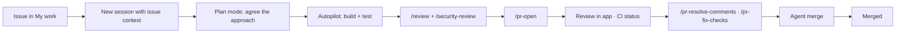

# Lab: GitHub Copilot App: Zero to Hero

> **Duration:** ~2 hours for the [Core Path](#choose-your-path) · ~4–5 hours for everything
> **Level:** Beginner → Intermediate
> **Prerequisites:** [Git](https://github.com/git-guides/install-git), [Node.js 22+](https://nodejs.org/), and a GitHub account with either an active [Copilot plan](https://github.com/features/copilot/plans) or credentials for your own model provider

## Objective

In this lab you will **build, review, and ship a Task Manager REST API** using the **GitHub Copilot app** — the agent-native desktop application for directing multiple AI agents at once.

You won't just chat with an agent. You'll run **parallel agent sessions on isolated worktrees**, hand work off between **Plan / Interactive / Autopilot** modes, pick up **issues** and land **pull requests** without leaving the app, build a **canvas** that you and the agent share, **orchestrate child sessions**, and set up **automations** that keep working after you close your laptop.

:::note The Copilot app is evolving fast
Slash commands, panels, and feature availability change frequently. Type `/` in the prompt box to see what's currently available in your context, and check the [official docs](https://docs.github.com/copilot/concepts/agents/github-copilot-app) if something looks different from what's described here.
:::

---

## Choose Your Path

This lab is longer than one sitting. Pick a path before you start.

| Path | Exercises | Time | For |
|------|-----------|------|-----|
| **Core** | 1, 2, 3, 4, 5, 6.1, 7, 9, 11 (read-only) | ~2 hrs | First exposure. Covers everything distinctive about the app. |
| **Full** | Everything | ~4–5 hrs | Going deep, or preparing to teach it. |
| **CSA demo** | [Exercise 12](#exercise-12--the-csa-demo-fast-path) | ~45–55 min | Delivering live to customers. |

Exercises are marked **🎯 Core** or **⭐ Optional** in their headings. If you're time-boxed, do the Core ones in order and come back for the rest.

:::warning Do the setup in Exercise 1 exactly as written
Two decisions in Exercise 1 (repository **visibility** and **initializing with a README**) determine whether Exercises 4, 7, and 11 work at all. Don't improvise them.
:::

### Badges used in this lab

| Badge | Meaning |
|-------|---------|
| 🖥️ **Local** | Runs on your machine. Stops when your machine sleeps. |
| ☁️ **Cloud** | Runs on GitHub. Continues when your machine is off. |
| 🧪 **Preview** | Public preview — subject to change, may not be enabled for you. |
| 🔐 **Gated** | Requires an organization or enterprise policy, or admin action. |
| 💳 **Metered** | Consumes GitHub Actions minutes and AI credits. |
| 🔒 **Private repo** | Requires a private or internal repository. Not available in public repos. |

---

## What You'll Build

A **Task Manager REST API** — plus the workflow around it:

- Express.js server with CRUD endpoints, Zod validation, and error handling
- Jest tests plus a GitHub Actions workflow, so pull requests have real CI
- A feature delivered **from a GitHub issue** to a **merged pull request**, without leaving the app
- Two features built **simultaneously** in parallel sessions on separate branches
- A custom **canvas** — a shared UI surface you and the agent both manipulate
- A **scheduled automation** that triages your repo every morning

## Why the App?

Copilot is available in the IDE, in the CLI, on GitHub.com, and in this desktop app. They overlap heavily, and the honest framing is not "the app can do things nothing else can."

**The app is the dedicated control center** for running and switching among local worktree and cloud sessions, managing GitHub work, and collaborating through canvases — without assembling that workflow yourself from an IDE, a terminal, and six browser tabs.

| Capability | IDE | Copilot CLI | **Copilot App** |
|-----------|-----|-------------|-----------------|
| Inline code completion | ✅ | ❌ | ❌ |
| Single agent session | ✅ | ✅ | ✅ |
| Built-in local worktree creation + visual session switching | ⚠️ manual | ⚠️ manual | ✅ **built in** |
| Launch cloud agent work that outlives your client | ✅ | ✅ | ✅ |
| **Unified control center for local *and* cloud sessions** | ⚠️ partial | ❌ | ✅ |
| Issue triage → session → PR → merge in one surface | ⚠️ via extensions | ⚠️ partial | ✅ |
| **Custom bidirectional canvases** | ❌ | ❌ | ✅ |
| Visual automation management | ❌ | ❌ | ✅ |

:::tip The one-sentence pitch
The app is built on Copilot CLI, so everything you know from the CLI still works — but it adds a **visual control center** for directing many agents across many branches, with GitHub's issue and PR lifecycle on the same screen.
:::

The rows in **bold** are where the app is genuinely differentiated, and they're where this lab spends most of its time.

---

## Exercise 1 — Install, Sign In, and Orient 🎯 Core

### 1.1 Install the App

Download the app for your platform from the [GitHub Copilot app download page](https://github.com/features/ai/github-app). macOS, Windows, and Linux are all supported.

:::note 🔐 Business and Enterprise users
The **GitHub Copilot app policy** must be enabled for your organization or enterprise. It is enabled by default and is *separate* from the Copilot CLI policy. If the app refuses to sign you in, check that policy first.
:::

### 1.2 Sign In

1. Open the app and click **Sign in to GitHub**.
2. Complete the browser OAuth flow.
3. If you use GitHub Enterprise Server, choose **Use GitHub Enterprise** and enter your server address.
4. If you don't have a Copilot plan, you can **continue with your own model provider** instead — see [10.6](#106-bring-your-own-model-byok--optional).
5. Pick a theme and finish onboarding.

### 1.3 Create the Lab Repository ⚠️ Read carefully

Create a **new repository on GitHub** named `task-manager-api` with these settings:

| Setting | Value | Why it matters |
|---------|-------|----------------|
| **Visibility** | **Private** or **Internal** | 🔒 **Automations are not available in public repositories.** Exercise 11 will not work otherwise. |
| **Owner** | An **organization**, if you have one | Cloud agent and automations behave best in org-owned repos. |
| **Initialize with a README** | ✅ **Yes** | A repo with no commits has no default branch. Worktree creation and PR targeting are unreliable without one. |

:::warning These two settings are not optional
A **public** repo blocks Exercise 11 entirely. An **empty** repo (no initial commit) makes Exercises 3, 4, and 7 fragile. Fixing either one later means recreating the repo.
:::

Confirm on GitHub that the repo shows a `main` branch containing your README before continuing.

### 1.4 Connect the Project

A **project** is a folder or repository the app can work in.

1. Click **+** in the sidebar next to **Sessions**.
2. Under **Add project from**, choose one of:
   - **Local folder or repository** — a folder already on your machine
   - **GitHub repository** — browse and clone from GitHub
   - **Repository URL** — clone from any Git URL (Azure DevOps, GitLab, self-hosted, or private repos without app access)

Choose **GitHub repository** and pick `task-manager-api`.

### 1.5 Learn the Sidebar

Click through each sidebar area. This map is the most useful thing to internalize — every exercise below lives in one of these:

| Sidebar area | What lives there |
|--------------|------------------|
| **My work** | Your issues and pull requests, filtered into sections (All, Active, Review requests, Done). CI status and reviews live here too. |
| **Automations** | Saved agent tasks that run on a schedule, on a repo event, or on demand |
| **Customize** | Plugins, skills, MCP servers, and canvases — discover and manage |
| **Search** | Search across your connected repositories |
| **Sessions** | Active agent sessions, grouped by project. Your parallel-work control center. |
| **Chats** | Conversations that *don't* create a branch or worktree |

### 1.6 Your First Session

1. Click **+** next to **Sessions** and choose your `task-manager-api` project.
2. From the dropdown under the prompt box, choose **where the session runs** (covered fully in [4.2](#42-where-a-session-runs)). Leave it on **New working tree**.
3. Below the prompt field, set:
   - **Session mode:** `Interactive`
   - **Model:** `Auto` (the app picks based on task complexity)
   - **Reasoning effort:** `Medium`
4. Prompt:

```text
Describe this repository: what's in it, what language and tooling it uses, and what you'd need in order to build a Node.js REST API here.
```

The repo contains only a README, so the agent should say roughly that — a good first signal that it's reading your files rather than guessing.

### 1.7 Name the Session

```text
/rename scaffold
```

Sessions get auto-generated names. Naming them becomes essential the moment you have five in the sidebar.

### ✅ Checkpoint

The app is installed and authenticated. You have a **private (or internal)** repo **initialized with a README**, connected as a project, with one named session running in its own worktree.

---

## Exercise 2 — Chats vs. Sessions: Think Before You Branch 🎯 Core

A common mistake is starting a full session — creating a branch and a worktree — just to ask a question. **Chats** exist for exactly that.

### 2.1 Open a Chat

Click **Chats** in the sidebar, then start a new conversation. Notice: no branch, no worktree, no diff pane.

### 2.2 Scope the Work in a Chat

```text
I'm about to build a Task Manager REST API in Node.js with Express and Zod, storing tasks in memory.

Before I write any code, help me pin down:
1. The resource shape for a task (fields, types, constraints)
2. The full endpoint list including filtering and stats
3. Which validation and error-handling patterns are worth standardizing up front
4. What the test strategy should be

Ask me clarifying questions if anything is ambiguous. Don't write code yet.
```

Iterate here until the design feels right. Answer its questions. **This is cheap thinking.**

### 2.3 Carry the Decision Into a Session

```text
Summarize our agreed design as a concise, self-contained implementation brief I can paste into a coding session. Include the task schema, endpoint list, validation rules, and test expectations.
```

Copy that brief — you'll use it in Exercise 3.

### 2.4 Why This Matters

| Use | Reach for |
|-----|-----------|
| "How should I model this?" | **Chat** |
| "What's the tradeoff between X and Y?" | **Chat** |
| "Explain how this repo's auth works" | **Chat** |
| "Implement the thing we agreed on" | **Session** |
| "Fix this failing test" | **Session** |
| "Pick up issue #42" | **Session** (started from the issue) |

Chats keep your Sessions list clean, avoid throwaway branches, and — per GitHub's own guidance — reduce rework and AI credit burn by clarifying requirements *before* an agent starts writing files.

:::tip Archive, don't delete
Right-click a chat in the sidebar and choose **Archive chat** to keep its history without cluttering the list. **Settings → Sessions → Manage sessions** lets you search, filter, bulk-archive, and see how much disk space each session's working files consume.
:::

### ✅ Checkpoint

You understand the Chats/Sessions split and have an implementation brief ready to hand to an agent.

---

## Exercise 3 — Plan Mode → Autopilot: Scaffold the API 🎯 Core

Now you'll use the mode ladder that defines app workflow: **Plan** to agree on the approach, then **Autopilot** to execute it.

### 3.1 The Three Session Modes

| Mode | Who drives | Use it when |
|------|-----------|-------------|
| **Interactive** | You and the agent together — it proposes, waits for your input | Tight steering, unfamiliar code, risky changes |
| **Plan** | Agent proposes a plan; **you approve before any execution** | Scope is fuzzy, or the change is big enough that you want to review the approach |
| **Autopilot** | Agent works fully autonomously — writes code, runs tests, iterates | The task is well defined and verifiable |

Switch at any time with the dropdown, or with `/interactive`, `/plan`, and `/autopilot`.

### 3.2 Enter Plan Mode

Return to your `scaffold` session, switch to **Plan** (or type `/plan`), then paste your brief from Exercise 2. If you skipped it, use this:

```text
Create a Node.js REST API project for a task manager in this repository.

Requirements:
- Express.js server, entry point src/index.js, port 3000
- Zod for validation
- src/routes/tasks.js with full CRUD: GET /tasks, GET /tasks/:id, POST /tasks, PUT /tasks/:id, DELETE /tasks/:id
- src/middleware/errorHandler.js for centralized error handling, using an AppError pattern
- In-memory array as the data store — no database
- A task has: id (uuid), title (string, 1-100 chars, required), description (string, optional, max 500), status (enum: todo | in-progress | done, defaults to todo), createdAt
- Jest + supertest configured, with tests for happy paths and validation failures
- A GitHub Actions workflow at .github/workflows/test.yml that runs npm ci and npm test on every pull request
- package.json scripts: start, dev, test
- A Node.js .gitignore

Plan the work. Do not execute yet.
```

:::note The CI workflow is required
`.github/workflows/test.yml` is what gives your pull requests real check runs. **Exercise 7 depends on it.** Don't drop it from the plan.
:::

### 3.3 Actually Read the Plan

The agent produces a step-by-step plan. **This is the highest-leverage 60 seconds in the lab.** Check:

- Is the file structure what you want?
- Are the dependencies right, and not bloated?
- Does the test strategy match what you agreed?
- Is the Actions workflow there?

Push back before approving:

```text
Two changes before we execute:
1. Add request logging middleware that logs method, URL, status, and response time.
2. Add a GET /health endpoint returning status, uptime, and version from package.json.
Update the plan.
```

### 3.4 Approve and Run on Autopilot

Approve the plan and let the session continue in **Autopilot**. The agent will create the structure, install dependencies, write tests, then run and fix them until green.

:::note Approvals and auto-approval
Autopilot may still ask permission for certain tools. `/allow-all-tools` (aliased `/yolo`) turns on auto-approval for the session — use it when you're actively watching. `/reset-allowed-tools` clears session approvals and turns auto-approval back off. Get in the habit of running it when you return to careful work.
:::

### 3.5 Inspect and Verify

Click **Changes** above the prompt box to see the full diff.

Then open a terminal *inside the app*:

```text
/terminal npm start
```

This opens a terminal in the right-hand panel. In a second terminal, or after stopping the server:

```text
/terminal curl -s -X POST http://localhost:3000/tasks -H "Content-Type: application/json" -d '{"title":"Learn the Copilot app"}'
```

:::tip The terminal is a canvas
`/terminal` isn't a shell-out; it's a canvas in the side panel — your first taste of the concept you'll build on in [Exercise 9](#exercise-9--canvases-the-shared-surface--core).
:::

### 3.6 Merge the Scaffold to `main` ⚠️ Required before Exercise 4 {#36-merge-the-scaffold-to-main--required-before-exercise-4}

**This step is not optional.** Your scaffold currently lives on this session's branch. Sessions you create in Exercise 4 branch from **`main`** — which right now contains only a README. If you skip this, those sessions will be asked to modify files that don't exist.

Open a pull request:

```text
/pr-open
```

Then merge it:

```text
/pr-merge
```

Verify on GitHub, or ask the agent:

```text
Confirm that main now contains src/routes/tasks.js and .github/workflows/test.yml.
```

:::warning Do not continue until `main` has the scaffold
This is the single most common place to get stuck in this lab. Confirm it before moving on.
:::

### 3.7 Ask It to Explain Its Own Work

```text
Summarize the architecture you just built. What does each file do, and what are the three weakest points in this implementation?
```

Asking for weaknesses consistently produces better output than "does this look good?"

### ✅ Checkpoint

You have a working, tested Express API **merged into `main`**, with a CI workflow. You know how to switch modes and reset tool permissions.

---

## Exercise 4 — Parallel Sessions: The App Superpower 🎯 Core

This is the exercise to pay attention to. Everything so far you could have done in the CLI or an IDE. This is where the app earns its place.

### 4.1 The Problem Parallel Sessions Solve

A single agent session is a queue: you ask, it works, you wait. Real work isn't a queue — you have a feature to build, a flaky test to chase, and a docs update that's been sitting for a week.

The app gives every session its **own git worktree and branch**, so several agents work in the same repository simultaneously without touching each other's files.

### 4.2 Where a Session Runs

The dropdown under the prompt box offers three runtimes. **These are genuinely different things** and the distinction matters:

| Runtime | Where code executes | Survives machine sleep? | Notes |
|---------|--------------------|-----------------------|-------|
| **New working tree** 🖥️ | Your machine, isolated worktree + branch | ❌ | **Default.** Anything parallel. |
| **Local repository** 🖥️ | Your machine, existing checkout and branch | ❌ | When you want changes in the checkout your IDE has open |
| **Cloud sandbox** ☁️ 🧪 | GitHub-hosted isolated environment | ✅ | Untrusted code, heavy installs, or keeping the agent off your machine entirely |

:::note Three things that sound alike but aren't
Customers conflate these constantly. Keep them straight:

- **Cloud sandbox** ☁️ 🧪 — an *app session runtime*. The session itself runs on GitHub instead of your laptop.
- **Cloud agent** ☁️ 💳 — asynchronous agent work running in a GitHub Actions-powered environment, launched from GitHub.com, an IDE, an issue assignment, or an automation. Not app-exclusive.
- **Remote control** 🖥️ 🔐 — the session stays **on your machine**; GitHub.com or GitHub Mobile only *steers* it. If your laptop sleeps, the work stops. See [13.2](#132-remote--reach-your-session-from-anywhere).

Only the first two keep running when your machine is off.
:::

:::note Why worktrees, not clones
A worktree shares the repo's object database and history but has its own working directory and branch — near-instant creation, no duplicated `.git`. Two worktrees can't check out the *same* branch; the app handles branch assignment for you.
:::

### 4.3 Launch Three Sessions at Once

With the scaffold now on `main` (Exercise 3.6), create three new sessions from **+**, each in a **new working tree**, each named with `/rename`.

**Session A — "filtering"** *(Interactive mode)*

```text
Add query-parameter filtering to GET /tasks:
- ?status=todo|in-progress|done
- ?q=<text> for case-insensitive search across title and description
- ?sort=createdAt|title and ?order=asc|desc
Validate query params with Zod and return 400 on invalid values. Add tests for each filter and combination.
```

**Session B — "stats"** *(Autopilot mode)*

```text
Add GET /tasks/stats returning:
{ total, byStatus: { todo, inProgress, done }, oldest, newest, completionRate }
completionRate is done/total as a percentage rounded to one decimal, 0 when total is 0.
Add tests including the empty-store edge case. Follow the existing code conventions.
```

**Session C — "docs"** *(Interactive mode)*

```text
Generate a comprehensive README.md: project description, setup, every endpoint with request/response examples and curl commands, error format, and how to run tests. Read the actual route files — don't invent endpoints.
```

Each session should now find real code to work with. If a session reports an empty repository, its base branch is wrong — revisit [3.6](#36-merge-the-scaffold-to-main--required-before-exercise-4).

### 4.4 Watch Them Run Concurrently

Click between the three sessions. Each has its own branch, worktree, transcript, context window, diff, model, and reasoning effort.

Session B (Autopilot) keeps working while you steer Session A. **That's the point** — your attention becomes the scarce resource, not agent throughput.

:::tip Match model to task
Set Session C (docs) to a lighter, faster model and Session A (filtering logic + validation) to a higher-capability one with higher reasoning effort. Per-session model selection is one of the quietest but most cost-effective features in the app.
:::

### 4.5 Land Them Independently

Each session opens its own pull request with `/pr-open`.

:::note What isolation does and doesn't buy you
**The app isolates execution; Git still arbitrates integration.** Separate worktrees stop agents from overwriting each other's local files. They do *not* prevent merge conflicts — if filtering and stats both touch `src/routes/tasks.js`, the second PR to merge may still need a rebase. That's normal, and it's a much better problem than three agents fighting over one directory.
:::

### 4.6 Clean Up

Go to **Settings → Sessions → Manage sessions**. Search, filter, check the disk-usage columns, and archive or delete what you're done with.

:::note Worktrees accumulate
Every session is real disk space. The **Manage sessions** view exists precisely because it's easy to end up with twenty stale worktrees.
:::

### ✅ Checkpoint

You ran three agents concurrently on isolated branches with per-session models and modes, and you can explain the difference between cloud sandbox, cloud agent, and remote control.

---

## Exercise 5 — Issue-Driven Development in "My work" 🎯 Core

Most real work starts with an issue, not a blank prompt. The app makes the issue the entry point.

### 5.1 Explore "My work"

Click **My work**. Your issues and pull requests appear grouped into sections — by default **All**, **Active**, **Review requests**, and **Done**.

Try:

- Search inside a section with a qualifier: `label:bug`, `is:open author:@me`
- Edit a default section's filter
- Add a section with your own filter, e.g. `assignee:@me is:open label:enhancement`

:::tip Make it your morning view
A section filtered to `review-requested:@me is:open` turns My work into a real triage dashboard — with CI status inline, so you can see what's actually reviewable.
:::

### 5.2 Have the Agent File an Issue

In any session:

```text
Create an issue in this repository proposing bulk operations for the task API:
- POST /tasks/bulk to create multiple tasks in one request
- DELETE /tasks/bulk to delete by an array of ids
- PATCH /tasks/bulk/status to update status on multiple tasks
Include acceptance criteria, validation rules, and edge cases (partial failures, empty arrays, unknown ids).
```

:::note Templates are respected
When an agent creates an issue it picks a repository issue template appropriate to the type. Name a specific template in your prompt to force one. The same applies to pull request templates.
:::

### 5.3 Start a Session From the Issue

1. Open **My work** and click the issue.
2. Click **New session** — the app opens a session **with the issue context already loaded**. You paste nothing.
3. Set mode to **Plan**.
4. Prompt:

```text
Implement this issue. Plan first, and call out anything in the acceptance criteria that's ambiguous or that you'd push back on.
```

### 5.4 Review, Refine, Execute

Review the plan against the acceptance criteria, refine, approve, and let it build in Autopilot.

### 5.5 Preserve the Reasoning

```text
Attach your implementation plan to this issue as an artifact so reviewers can see the approach before they read the diff.
```

Small habit, outsized payoff: the *why* lives where stakeholders already look, instead of evaporating with your session transcript.

### 5.6 Open the PR — and Leave It Open

```text
/pr-open
```

**Do not merge this one.** Exercise 7 uses it.

### ✅ Checkpoint

You filed an issue from an agent, launched a session from it with context pre-loaded, planned against its acceptance criteria, attached the plan back, and opened a PR that's waiting for Exercise 7.

---

## Exercise 6 — Verification: Review Before Anyone Else Does

The app ships several review agents. They're not redundant — each looks for something different.

### 6.1 `/review` — General Code Review 🎯 Core

In the session with your bulk-operations changes:

```text
/review
```

This reviews the **current session's changes** for bugs, logic errors, and correctness. It ignores style noise.

### 6.2 `/security-review` — Vulnerability-Focused ⭐ Optional

```text
/security-review
```

🧪 **Public preview.** Runs a security-focused pass over current diffs and returns **prioritized findings with severity and confidence scores**, plus suggested fixes you can apply in the same session. Requires an active session **with changes**.

This is a *pre-PR* check. It complements — rather than replaces — code scanning, Dependabot, and secret scanning.

### 6.3 `/rubber-duck` — A Second Opinion From a Different Model ⭐ Optional

```text
/rubber-duck Critique my bulk operations implementation. Focus on partial-failure semantics and whether the API contract is coherent.
```

A built-in constructive critic that **runs on a different model than the one driving your session** — so you get independent judgment rather than a model agreeing with itself. Copilot can also consult it automatically at key points.

:::note Model requirement
Currently available only when the main agent is using a Claude or GPT model. Switch with `/model` if it's unavailable.
:::

### 6.4 `/spar` — Adversarial Pressure-Testing ⭐ Optional

```text
/spar We're storing tasks in memory and shipping bulk endpoints with no rate limiting. Argue why that's a mistake.
```

Challenges your approach. Use it on design decisions, not line-level code.

### 6.5 Introduce a Bug and Catch It 🎯 Core

Let's give the reviewer something real to find:

```text
In src/routes/tasks.js, change the DELETE route to use findIndex but remove the check for -1 before calling splice. Make only that change and do not fix it.
```

Start the server and create two tasks:

```text
/terminal npm start
```

```text
/terminal curl -s -X POST http://localhost:3000/tasks -H "Content-Type: application/json" -d '{"title":"Task 1"}'
```

```text
/terminal curl -s -X POST http://localhost:3000/tasks -H "Content-Type: application/json" -d '{"title":"Task 2"}'
```

Now delete a task that doesn't exist, then list what's left:

```text
/terminal curl -s -X DELETE http://localhost:3000/tasks/does-not-exist && curl -s http://localhost:3000/tasks
```

No error, no crash — but **one of your real tasks is gone**. When `findIndex` returns `-1`, `splice(-1, 1)` removes the *last* element. Exactly the class of bug that survives a casual eyeball review.

Now:

```text
/review
```

:::note If `/review` doesn't flag it
Model output isn't deterministic. If the first pass misses it, narrow the ask: `/review Look specifically at the DELETE handler's index handling.` That's a useful lesson in itself — targeted review prompts beat broad ones.
:::

Apply the fix.

### 6.6 Compare the Reviewers

| Command | Looks for | Runs on |
|---------|----------|---------|
| `/review` | Bugs, logic errors, correctness in current changes | Session changes |
| `/security-review` 🧪 | Exploitable vulnerabilities, ranked by severity + confidence | Session changes |
| `/rubber-duck` | Design and implementation critique | A *different* model than your session |
| `/spar` | Adversarial challenge to your reasoning | Your stated approach |

### ✅ Checkpoint

You ran the verification agents, know what each is for, and caught a genuinely subtle bug before it reached a pull request.

---

## Exercise 7 — The Pull Request Lifecycle, End to End 🎯 Core

Here the app collapses three tools into one. You'll take a change from diff to merged without opening a browser.

### 7.1 Set Up Real Review and CI Context ⚠️ Do this first {#71-set-up-real-review-and-ci-context--do-this-first}

`/pr-resolve-comments` and `/pr-fix-checks` are **context-gated** — they only appear when there are actually unresolved comments or failing checks. Nothing so far guarantees either. Create them deliberately.

**a) Make a check fail.** In the session holding your open PR from [5.6](#56-open-the-pr--and-leave-it-open):

```text
Add a test to the bulk operations test file asserting that POST /tasks/bulk rejects an empty array with a 400. Do not change the route implementation — I want this test to fail. Commit and push it.
```

Your `.github/workflows/test.yml` from Exercise 3 will now run and go red on the PR.

**b) Leave unresolved review comments.** Open the PR in **My work** → **Files changed**, and leave **two inline review comments** on changed lines, for example:

> This doesn't validate that the array is non-empty. What happens with `[]`?

> Partial failures aren't handled — if one id is unknown, does the whole request fail?

Submit them as a review with **Comment** (not Approve).

:::note Working solo is fine
You can leave review comments on your own pull request. GitHub only stops you from **approving** it. That's all `/pr-resolve-comments` needs.
:::

Confirm the PR now shows a **failing check** and **unresolved comments** before continuing.

### 7.2 Review a PR in the App

Open **My work** and click the pull request. You get:

- The **overview**: summary, **CI check results**, review activity
- The **Files changed** tab: the full diff
- A **New session** button to start a session scoped to that PR

Start a PR-scoped session and ask:

```text
Review this pull request as a senior engineer. Focus on correctness and API contract consistency with the existing endpoints. Flag anything that would break existing clients.
```

You can also draft your own review comments on the diff from the session, then click **Review** at the top of the PR detail view to submit.

:::tip Staged, not posted
Comments you draft in a session are staged into your pending review. Nothing reaches GitHub until you submit.
:::

### 7.3 Resolve the Review Feedback

From the PR-scoped session:

```text
/pr-resolve-comments
```

Or click the **Copilot / Fix** button on an individual comment in the PR view.

:::note Replies land in the thread
When an agent resolves a comment, the reply goes **into the review thread**, under the reviewer's comment — not as a disconnected top-level PR comment. That's how review conversations are supposed to work, and it's a real difference from pasting a summary at the bottom.
:::

### 7.4 Fix the Failing CI

```text
/pr-fix-checks
```

Or click **Fix failing checks** on the pull request. The agent reads the failure output, diagnoses it, and pushes a fix — in this case, implementing the empty-array validation your seeded test demanded.

### 7.5 Merge — Manually or With Agent Merge

```text
/pr-merge
```

Or turn on **agent merge** at the top of the app. Agent merge prompts the workspace's Copilot session to read the PR, fix what's blocking it (review comments, failing checks, merge conflicts), and merge as soon as GitHub allows. It **runs in the background, survives app restarts, and turns itself off once the PR is merged.**

:::tip This is the "walk away" feature
Agent merge is the clearest expression of the app's design philosophy: state the outcome you want and let a persistent background process drive toward it.
:::

### 7.6 The Full Loop



### ✅ Checkpoint

You created real review and CI context, then opened, reviewed, revised, unblocked, and merged a pull request without leaving the app.

---

## Exercise 8 — Orchestration: Agents That Direct Agents ⭐ Optional

Exercise 4 ran sessions in parallel *by hand*. Orchestration lets an agent create and steer them for you.

:::note Pick one, read the rest
Running every command below would create a dozen sessions and several PRs. **Do 8.1 hands-on**, then use the decision table in [8.6](#86-choosing-the-right-tool) as reference. 💳 Each spawned agent consumes AI credits.
:::

### 8.1 `/orchestrate` — Coordinate Child Sessions 🎯 Do this one

```text
/orchestrate Split the remaining Task Manager work into independent workstreams and run them in parallel child sessions:
1. Add pagination (?page, ?limit) to GET /tasks with tests
2. Add a rate-limiting middleware with tests
Each workstream should end with a pull request. Report back with the PR links when they're done.
```

The `orchestrate` skill creates child sessions, gives each full context, and coordinates them. Watch the **Sessions** sidebar — child sessions appear **nested under their creator**, making the relationship visible at a glance.

Its defining property is *coordinated child sessions* — the work doesn't have to be unrelated, though independent workstreams parallelize best.

### 8.2 `/spawn` — One Focused Child Session

```text
/spawn Update the README to document the new pagination and rate-limiting behavior, matching the existing documentation style. Report back when done.
```

### 8.3 `/fork` and `/merge-to-parent` — Explore an Alternative

```text
/fork
```

Forks the current session at the latest turn into a new worktree, **carrying your conversation history with it**. Try the alternative approach there:

```text
Rewrite the in-memory store as a small repository class with an interface that would let us swap in SQLite later, without changing the route handlers.
```

Like the result? `/merge-to-parent`. Don't? Archive the fork — your original was never touched.

:::tip Fork branches your *conversation*, not just your code
Git branches files. `/fork` branches files **and** the agent's accumulated context. No real equivalent in IDE chat.
:::

### 8.4 `/fleet` — Parallel Subagents on One Task

```text
/fleet Audit this codebase for missing error handling, missing input validation, and untested code paths. Produce one consolidated prioritized report.
```

Multiple agents in parallel on a **single** task, consolidated. (Also available in Copilot CLI — not app-specific.)

### 8.5 `/pr-stack` — Dependent Pull Requests

```text
/pr-stack Break the persistence refactor into a stack of dependent PRs:
1. Introduce the repository interface (no behavior change)
2. Move the in-memory store behind that interface
3. Add a SQLite implementation behind a feature flag
```

Creates dependent PRs with **one child session per layer**, plus native GitHub stack linking — reviewers get small coherent diffs instead of one 2,000-line PR.

### 8.6 Choosing the Right Tool

| You want to… | Use |
|--------------|-----|
| Run several tasks as coordinated child sessions | `/orchestrate` |
| Hand off one side task | `/spawn` |
| Throw more agents at *one* big task | `/fleet` |
| Try an alternative without losing your current path | `/fork` |
| Ship a big change as reviewable layers | `/pr-stack` |
| Run your own parallel work manually | Multiple sessions (Exercise 4) |

### ✅ Checkpoint

You've used orchestration hands-on and can articulate which primitive fits which shape of work.

---

## Exercise 9 — Canvases: The Shared Surface 🎯 Core

If parallel sessions are the app's most *useful* feature, canvases are its most *distinctive*. Nothing else in the Copilot family has this.

### 9.1 What a Canvas Actually Is

Chat is good for defining intent. But most real work happens in a **work surface**: a terminal, a browser, a document, a dashboard, a board. A **canvas** is that surface, opened in the app's right-hand panel, and it is **bidirectional**:

- The **agent** updates the canvas while it works
- **You** edit the same surface directly
- The agent continues *from your edits*

You've already used two without thinking about it: `/terminal` opens a terminal canvas, and viewing a markdown artifact opens an editor canvas.

### 9.2 Browse the Featured Canvases

1. **Customize** → **Canvas**
2. Browse the featured list. Some come from plugins and require installing the plugin first.
3. Click **Installed** to see what's already available.

:::tip Open one before you build one
Opening a prebuilt canvas takes seconds and shows the concept immediately. Building one takes minutes. Do them in that order — especially if you're demoing.
:::

### 9.3 Build Your Own Canvas

In an active session:

```text
/create-canvas Create an agentic kanban board for this repository's tasks.

People should be able to:
- Add a card with a title, description, and status
- Move cards between columns (Todo, In Progress, Done)
- Filter cards by status and by text search

The agent should be able to call:
- get_board to read the current board state
- add_card to create a card
- move_card to change a card's status
- summarize_board to report progress

Persist the board state so it survives a restart. Scope it to the project so my team gets it too.
```

Choose the scope when prompted:

| Scope | Location | Use for |
|-------|----------|---------|
| **Project** | `.github/extensions` | Team-shared canvases, committed to the repo |
| **User** | `~/.copilot/extensions` | Personal canvases on your machine |

:::note This takes a few minutes
The agent generates extension files, may install dependencies, reloads the extension, and renders the UI. Be patient.
:::

### 9.4 Work In It — Both Directions

**You drive:** add a few cards through the UI, move one to In Progress.

**The agent drives:**

```text
Read the board and add a card for every open issue in this repository, in the Todo column.
```

```text
Summarize the board: what's in flight, what's blocked, and what I should pick up next.
```

Both of you are manipulating the *same state*. You didn't describe the board to the agent, and it didn't describe the board back to you.

### 9.5 Iterate on the Canvas Itself

```text
Add a "Blocked" column to the board, an agent-callable block_card action that takes a reason, and show the blocking reason on the card.
```

### 9.6 How It's Structured

A canvas extension lives under `.github/extensions` (project) or `~/.copilot/extensions` (user), and typically includes:

- `package.json` — extension metadata and dependencies
- An entry file such as `extension.mjs` — behavior and agent-callable capabilities
- Optional JSON artifacts (e.g. an `artifacts/` directory) for persisted state

A project-scoped canvas is committed, so **your whole team gets it on their next pull.**

### 9.7 Other Things Worth Building as Canvases

- **Issue triage board** — top issues, recurring themes, pain points
- **Markdown day-planner** — meetings, prioritized issues and PRs, plus buttons to launch and monitor sessions
- **Release checklist** — gated steps the agent ticks off as it verifies each
- **Incident canvas** — timeline, current hypothesis, commands run, findings
- **Document canvases** — documents, spreadsheets, and slide decks in the app

### ✅ Checkpoint

You've built a canvas from a prompt, driven it from both the UI and the agent, iterated on its capabilities, and know where it lives and how to share it.

---

## Exercise 10 — Customize: The App's Discovery Surface ⭐ Optional

The app inherits the entire Copilot CLI customization ecosystem. **The app-specific value is the visual discovery and management UI**, not the underlying mechanisms.

:::tip Don't relearn this here
Skills, custom agents, hooks, and MCP authoring are covered in depth in the [Copilot Customization Workshop](/workshops/copilot-customization) and the [Copilot CLI lab](/labs/copilot-cli-zero-to-hero). This exercise is about what the *app* adds.
:::

### 10.1 Everything Carries Over — Verify It

Any MCP servers and skills already configured for your repositories or for Copilot CLI are **automatically available** in the app. Nothing to reconfigure.

1. **Customize** → **Installed**
2. Confirm you can see skills and MCP servers you already had

### 10.2 App-Specific Instruction Layers

Beyond the standard repo files, the app adds two settings-based layers:

**Global — every session, every project:** Settings → **Sessions** → **App instructions**

```text
Always explain the "why" behind a change, not just the "what".
Prefer small, reviewable diffs. If a change exceeds ~300 lines, propose splitting it.
Never commit secrets, and flag any credential-shaped string you encounter.
```

**Repository-specific:** Settings → **Projects** → *your repo* → **Instructions**

| Layer | Scope | Shared with team? |
|-------|-------|-------------------|
| App instructions (settings) | Every session, every project | ❌ Just you |
| Project instructions (settings) | Every session for one repo | ❌ Just you |
| `.github/copilot-instructions.md` | The repository | ✅ Committed |
| `.github/instructions/**/*.instructions.md` | Path-scoped via `applyTo` | ✅ Committed |

Generate the committed one with `/init`, then verify it took hold:

```text
Add a PATCH /tasks/:id/status endpoint that only updates status. Follow the project conventions.
```

### 10.3 Browse Plugins and MCP in the UI

**Customize** → **Plugins** shows plugins from configured marketplaces. **Customize** → **MCP** lets you browse **trending** servers or by category.

:::note Installing is optional for this lab
🔐 Plugin and MCP availability varies by enterprise policy, and many MCP servers need their own authentication. **Browse the UI rather than installing** if you're in a workshop — installation delays are the most common way a group session falls behind.
:::

Enterprises can add a **custom marketplace** (gear icon next to the marketplace dropdown) — any GitHub repo or Git URL hosting marketplace metadata. That's the realistic path to distributing internal, approved agent tooling.

### 10.4 Find Things by Task

```text
/af I need something to query a Postgres database from an agent session
```

`/af` searches Agent Finder for installable MCP servers, tools, skills, and agents.

### 10.5 Custom Agents

Use the **agent picker** in the prompt box, or `/agent`, to select a specialized agent with its own expertise, model, and tool restrictions.

### 10.6 Bring Your Own Model (BYOK) ⭐ Optional

🧪 **Public preview.** Settings → **Model providers** → **Add provider**. Supported: **OpenAI, Azure OpenAI, Microsoft Foundry, Anthropic, Ollama, Foundry Local, LM Studio**, and any OpenAI-compatible HTTP endpoint. Credentials are stored in the system credential store and never displayed in the UI.

You need a GitHub account to use the app, but **not a Copilot plan** if you bring your own provider. With a plan, you can use both.

:::note Be precise about what BYOK buys
BYOK gives you **provider and model control**. Whether that satisfies a specific data-residency or compliance requirement depends on the provider, endpoint, region, and contract — it isn't automatic. Organizations and enterprises configure custom models separately from this per-machine setting.
:::

### 10.7 Enterprise Governance ⭐ Optional

Worth knowing if you field admin questions:

- Enterprise and org owners set **policies** governing Copilot across surfaces
- Enterprises can control which actions users may take — including **which plugins users can install** and **whether "YOLO-style" auto-approval is permitted** — via **enterprise managed settings**, deployed three ways:

| Method | Where |
|--------|-------|
| Server-managed | `.github-private/copilot/managed-settings.json` |
| File-based | macOS `/Library/Application Support/GitHubCopilot/managed-settings.json` · Windows `%ProgramFiles%\GitHubCopilot\managed-settings.json` · Linux `/etc/github-copilot/managed-settings.json` |
| MDM-managed | Native policy values, not a deployed JSON file |

### ✅ Checkpoint

You know what the Customize UI adds, how the app's instruction layers stack, and where enterprise controls live.

---

## Exercise 11 — Automations: Work That Happens Without You 🎯 Core (read) / ⭐ Optional (build)

Sessions require you. **Automations don't.** This turns the app from a tool you use into infrastructure that runs.

### 11.1 Prerequisites — Check These First 🔒 🔐 💳

Automations have real requirements. Verify before building:

| Requirement | Detail |
|-------------|--------|
| 🔒 **Private or internal repository** | **Automations are not available in public repositories.** |
| **Write access** | Any user with write access to the repo can create automations. |
| 🔐 **Cloud agent enabled** | For Copilot Business/Enterprise, an **administrator must enable the Copilot cloud agent policy**. |
| **Org allows automations** | Once cloud agent is on, the org must allow cloud agent and automations in the repo — these are allowed by default unless opted out. |
| **Plan** | Copilot Pro, Pro+, Max, Business, or Enterprise. |

:::warning Two different policies, two different defaults
The **GitHub Copilot app policy** is enabled by default. The **Copilot cloud agent policy** for Business/Enterprise is **not** — an admin must turn it on. Don't assume the second because you observed the first.
:::

If you can't meet these, **read this exercise rather than building it** — the concepts still matter, especially for customer conversations.

### 11.2 Local vs. Cloud

| | 🖥️ **Local automation** | ☁️ **Cloud automation** |
|---|---|---|
| Runs on | Your machine | GitHub-hosted environment |
| Machine must be on | ✅ Yes | ❌ No |
| Custom CRON expressions | ✅ | ❌ (fixed trigger types) |
| Tool scoping | Session permissions | **Explicit `Tools` allow-list** |
| Best for | Local build/test/analysis loops | Triage, monitoring, anything overnight |

### 11.3 Create a Daily Triage Automation

1. **Automations** → **New automation**
2. **Name:** `Daily repo triage`
3. **Trigger:** `Daily`, hour `08`, minute `30`
4. Enable **Run in the cloud**
5. Under **Tools**, select only what the task needs — reading issues and updating labels. **Not** pushing code. (There's a **Suggest tools** button that proposes tools based on your prompt — useful, but still review what it picks.)
6. **Prompt:**

```text
Triage this repository and report:

1. New issues opened in the last 24 hours — summarize each in one line and suggest labels
2. Open pull requests that are blocked: failing checks, merge conflicts, or no review after 48 hours
3. Any issue with no activity for 14+ days that looks stale
4. One recommended priority for today, with a one-sentence justification

Keep it under 300 words. Lead with anything that needs a decision from me.
```

7. Set **model** and **reasoning effort** (a lighter model is usually fine for triage)
8. **Select project** → your repository
9. Open the dropdown next to **Create** → **Create and run** to test immediately

### 11.4 Trigger Types

| Trigger | Behavior |
|---------|----------|
| **Manual** | Runs only when you press play |
| **Hourly** | Every hour |
| **Daily** | One or more hours, plus a minute |
| **Weekly** | One or more days + a time |
| **CRON** | Custom expression (🖥️ local only), validated with a human-readable preview |
| **Issue** | Issue created. Optional search-query filter. |
| **Pull request** | PR opened, or new commits pushed. Optional search-query and changed-files filters. |

**Add another trigger** combines them — the automation fires when *any* trigger occurs.

### 11.5 Build an Event-Driven Automation ⭐ Optional

- **Name:** `New issue auto-triage`
- **Trigger:** `Issue` → *issue created*
- **Run in the cloud:** on
- **Tools:** issue labeling and commenting only
- **Prompt:**

```text
A new issue was just opened. Do the following:
1. Classify it as bug, feature, question, or docs, and apply the matching label
2. Check whether it duplicates an existing open issue; if so, link it
3. If it's a bug report missing reproduction steps, environment, or expected vs actual behavior, post a polite comment asking for exactly what's missing
4. Do not close anything and do not modify code
```

Open a test issue and watch it fire.

### 11.6 What a CSA Needs to Know 🎯 Core

These matter more to an enterprise buyer than a second sample automation:

| Topic | Reality |
|-------|---------|
| **Visibility** | An automation is **private to the user who created it** — even repository administrators can't see it. The cloud agent **sessions** it starts *are* visible to anyone with repo access, including the prompt and logs. |
| 💳 **Billing** | Each run starts a cloud agent session consuming **GitHub Actions minutes and AI credits**, billed to the automation's creator. |
| **Least privilege** | The **Tools** allow-list is the main control. An automation that labels issues shouldn't be able to push commits. |
| **Prompt injection** | Automations **ignore events triggered by users without write access by default** — so an external contributor opening an issue can't drive your agent. You can opt in, but understand why you're doing it. |
| **Attribution** | PRs and commits from an automation are attributed to its creator, who therefore **cannot approve them** — review controls are preserved. |
| **Not versioned** | Automation definitions are stored outside your repository. They're **not committed to Git**, not code-reviewed, and not restorable via revert. |
| **Secrets** | Never put secrets in an automation prompt — session logs are visible to collaborators. Use repository secrets. |
| **Inherited config** | Automations inherit the repo's cloud agent configuration: custom instructions, agent skills, firewall rules, and secrets/variables. |

You can also manage **your own** automations from the **Agents** tab of the repository on GitHub, in the **Automations** pane.

### 11.7 Cloud Agent Readiness ⭐ Optional

Cloud runs fail for boring environmental reasons: dependencies won't install, credentials are missing, or the firewall blocks a registry. The built-in `customize-cloud-agent` skill handles this:

```text
Set up the cloud agent environment for this repository so automations can install dependencies and run the test suite reliably.
```

It covers `copilot-setup-steps.yml`, preinstalled tools and dependencies, runners, and settings. Also worth reviewing before a cloud demo: repository **secrets and variables**, and **firewall rules** for any external host your build needs.

### 11.8 Deep Links ⭐ Optional

Launch the app — into a specific repo, issue, PR, session, or automation — from a link. This embeds Copilot into runbooks, docs, and ticketing systems.

```text
https://github.com/copilot/app/launch?open=ENCODED_APP_LINK
```

Use the official `ghapp://` scheme:

| Target | App link |
|--------|----------|
| Repository | `ghapp://github.com/OWNER/REPO` |
| Issue | `ghapp://github.com/OWNER/REPO/issues/NUMBER` |
| Pull request | `ghapp://github.com/OWNER/REPO/pull/NUMBER` |
| New session | `ghapp://session/new?repo=OWNER%2FREPO&mode=plan&prompt=...` |
| Automations page | `ghapp://automations` |
| New automation draft | `ghapp://automations/new?name=...&trigger=daily&time=09%3A00&prompt=...` |

New-session parameters: `repo` (required), `branch` *or* `pr` (**mutually exclusive**), `prompt`, and `mode` (`plan` \| `interactive` \| `autopilot`).

```text
Generate a GitHub Copilot app deep link that opens a new plan-mode session in this repository with a kickoff prompt of "Investigate failing tests". Give me the fully encoded launcher URL and explain the encoding.
```

:::note Two things to know
Deep links open a **draft or confirmation UI** — they don't silently create sessions or automations. And **never put secrets in a deep link**: prompts in URLs land in browser history and server logs.
:::

### ✅ Checkpoint

You know the real prerequisites for automations, the local/cloud split, and the visibility, billing, and security facts that come up in every enterprise conversation.

---

## Exercise 12 — The CSA Demo Fast Path

Delivering live? Use this. It's organized as **three chapters** rather than a feature list, so the audience follows a story.

:::warning Realistic duration: 45–55 minutes
The beats below sum to ~40 minutes *before* transitions, questions, model latency, and recovery. Don't promise 30 unless you cut Chapter 3.
:::

### Before the room

- `task-manager-api` scaffolded, **merged to `main`**, and pushed
- Two issues filed
- **PR #1:** clean, ready to demo `/pr-open` output
- **PR #2:** pre-seeded with a **failing check** and **two unresolved review comments**
- A **prebuilt canvas** already installed and working
- A **cloud automation** already created, with at least one successful run in its history
- The `splice(-1,1)` bug already seeded in a session
- All sessions pre-warmed — dependencies installed, servers started once

### Chapter 1 — Direct work (12 min)

| # | Beat | Time | The line to land |
|---|------|------|------------------|
| 1 | Sidebar tour — My work, Sessions, Automations, Customize | 2 min | "One window instead of a terminal, an IDE, and six browser tabs." |
| 2 | Start a session from an **issue** in My work | 3 min | "The issue context is already loaded. I pasted nothing." |
| 3 | **Plan mode** → review → push back → approve → **Autopilot** | 5 min | "I approve the *approach*, not every keystroke." |
| 4 | `/review` on the seeded bug | 2 min | "That passes a human eyeball review. It doesn't pass this." |

:::tip Beat 4 is not deterministic
If `/review` misses the bug, don't stall — narrow the prompt live (`/review Look at the DELETE handler's index handling`) and make *that* the lesson: targeted review prompts beat broad ones. Have a screenshot of a successful run as backup.
:::

### Chapter 2 — The parallel control center (13 min)

| # | Beat | Time | The line to land |
|---|------|------|------------------|
| 5 | While Chapter 1's Autopilot still runs, start **two more sessions** on other branches | 6 min | **The money shot.** "Three agents, three branches, one repo. The app isolates execution; Git still arbitrates integration." |
| 6 | Switch between all three, showing per-session model and mode | 3 min | "My attention is the scarce resource now, not agent throughput." |
| 7 | `/pr-open` from the finished session | 4 min | "Session to pull request, one command." |

### Chapter 3 — Persistent workflows (15 min)

| # | Beat | Time | The line to land |
|---|------|------|------------------|
| 8 | **Switch to pre-seeded PR #2** in My work. Open **its** PR-scoped session. Then `/pr-resolve-comments` and `/pr-fix-checks`. | 6 min | "Replies land *in the review thread*, not as a comment dump." |
| 9 | Turn on **agent merge** on that PR | 2 min | "Runs in the background, survives an app restart, switches itself off when the PR merges." |
| 10 | Open the **prebuilt canvas**. Drive it from the UI, then from the prompt. Show the `/create-canvas` prompt that made it. | 4 min | "Chat is for intent. This is where work actually lives." |
| 11 | Show the **existing cloud automation**, its run history, and its **Tools** allow-list | 3 min | "This runs at 8:30 with my laptop shut — and it can label issues but not push code." |

:::warning Beat 8 is a context switch — say it out loud
`/pr-open` in Beat 7 created a *new* PR. The seeded PR with the failing check is a **different object**. Explicitly navigate to it in My work and start its own session, or the commands won't be available and you'll look lost.
:::

### Demo survival tips

- **Pre-warm everything.** Cold `npm install` on stage is a career-limiting move.
- **Never build a canvas live.** Open the prebuilt one, demo bidirectionality, *then* show the creation prompt if time allows.
- **Never create an automation live.** Show one with real run history — the output is the point, not the form.
- **Let Autopilot run while you talk over it.** The parallelism is the story; don't stare at a spinner.
- **Know your audience's plan.** Cloud sandboxes and `/security-review` are 🧪 preview; automations need 🔒 a private/internal repo and 🔐 cloud agent enabled.
- **Have a fallback for every model-dependent beat.** Beats 4 and 10 are the two most likely to wobble.

---

## Exercise 13 — Session Intelligence and Remote Control ⭐ Optional

### 13.1 `/chronicle` — Mine Your Own History

The app is built on Copilot CLI, so your app sessions land in the same searchable history:

```text
/chronicle standup
```

Summarizes your work from the last day — genuinely useful at 9:01am.

```text
/chronicle search bulk operations validation
```

```text
/chronicle cost-tips
```

Suggestions for reducing token usage and cost based on **your actual usage patterns**. Underrated.

```text
/chronicle improve
```

Suggests improvements to your instructions file based on what you keep correcting manually. If you find yourself repeating the same feedback to agents, run this.

Also: `/chronicle tips` and `/chronicle reindex`.

### 13.2 `/remote` — Reach Your Session From Anywhere 🖥️ 🔐 {#132-remote--reach-your-session-from-anywhere}

```text
/remote
```

Lets you monitor and steer the current session from **GitHub.com or GitHub Mobile**.

:::warning Remote control does not mean "runs in the cloud"
This is the most commonly misunderstood feature in the app.

- **The session still runs on your machine.** Every shell command, file operation, and tool call executes locally.
- **Your machine must stay online.** If it sleeps or loses connectivity, remote control is unavailable until it's back. Use `/keep-alive` to prevent sleep.
- **Slash commands don't work remotely.** You can submit prompts, answer questions, approve permission requests and plans, switch modes, and cancel work — but not run `/allow-all` or similar.
- 🔐 **Policy-gated.** An enterprise or org owner must set the "Store local sessions in the Cloud" policy to **View and control**. It's unconfigured by default, so this is *off* until someone turns it on.

If you need work that survives a closed laptop, you want a **cloud sandbox** or a **cloud automation**, not remote control.
:::

### 13.3 `/inbox` — The Work Widget

```text
/inbox
```

Renders an interactive inbox widget of your work items. Empty if you have none. A small example of the app's shared-surface philosophy.

### 13.4 Context and Cost Management

| Command | What it does |
|---------|-------------|
| `/context` | Current session's context usage |
| `/compact` | Summarizes earlier conversation to relieve token pressure |
| `/usage` | Usage and rate-limit details for your plan |
| `/clear` or `/reset` | Clears the transcript, starts fresh |
| `/restart-session` | Restarts the session, keeps history |

**The single most effective cost habit:** start a new session when you switch tasks. Fresh context stops you paying to carry irrelevant history into unrelated work.

### 13.5 Sharing and Debugging

| Command | What it does |
|---------|-------------|
| `/export-gist` | Exports the transcript to a secret gist |
| `/attach-files` / `/attach-folder` | Attach files or a folder to your message |
| `/collect-debug-logs` | Creates a debug log archive, or uploads as a secret gist |
| `/debug` | Copies session debug JSON to your clipboard |

### 13.6 Voice Dictation

1. Settings → **Voice dictation**
2. Choose a keyboard shortcut
3. Allow microphone access in your OS settings
4. **Download a local transcription model**

Transcription runs **locally**; text lands in the prompt box for you to review before sending.

### ✅ Checkpoint

You can mine session history for standups, cost savings, and instruction improvements — and you can explain precisely what remote control does and does not do.

---

## Self-Guided Completion Checklist

- [ ] Explain when to use a **Chat** vs. a **Session**, and why it saves money
- [ ] Run **three sessions in parallel** on isolated worktrees, with different models and modes
- [ ] Distinguish **cloud sandbox**, **cloud agent**, and **remote control** — and say which survive a closed laptop
- [ ] Move a task deliberately through **Plan → Autopilot**, and reset tool permissions afterward
- [ ] Start a session **from an issue** and attach the plan back to that issue
- [ ] Name what `/review`, `/security-review`, `/rubber-duck`, and `/spar` each do differently
- [ ] Create real CI and review context, then take a PR through `/pr-resolve-comments`, `/pr-fix-checks`, and merge
- [ ] Choose correctly between `/orchestrate`, `/spawn`, `/fleet`, `/fork`, and `/pr-stack`
- [ ] **Build a canvas** and drive it from both the UI and the agent
- [ ] Layer instructions from global → project → repo → path-specific
- [ ] State the automation prerequisites (🔒 private repo, write access, 🔐 cloud agent policy) and who can see an automation
- [ ] Use `/chronicle` to summarize your work and improve your instructions

---

## Quick Reference

### Session Modes

| Mode | Slash command | Autonomy |
|------|--------------|----------|
| Interactive | `/interactive [prompt]` | Agent proposes, waits for you |
| Plan | `/plan [prompt]` | Agent plans, you approve, then it executes |
| Autopilot | `/autopilot [prompt]` | Fully autonomous |

### Essential Slash Commands

| Command | Purpose |
|---------|---------|
| `/plan`, `/interactive`, `/autopilot` | Switch session mode |
| `/model` or `/models` | Select model (including BYOK and `Auto`) |
| `/agent` | Select a custom agent |
| `/review` | Review the current session's changes |
| `/security-review` 🧪 | Security-focused review of current diffs |
| `/rubber-duck` | Critique from a different model |
| `/spar` | Adversarial challenge to your approach |
| `/pr-open` | Open a PR from session changes |
| `/pr-resolve-comments` | Work through unresolved review comments |
| `/pr-fix-checks` | Address failing PR checks |
| `/pr-merge` | Merge the current PR |
| `/orchestrate` | Coordinate work across child sessions |
| `/spawn` | Create a focused child session |
| `/fleet` | Multiple agents in parallel on one task |
| `/fork` | Fork the session at the latest turn |
| `/merge-to-parent` | Merge a forked session back |
| `/pr-stack` | Create a stack of dependent PRs |
| `/create-canvas` | Build a canvas extension |
| `/terminal [cmd]` | Open a terminal canvas in the side panel |
| `/inbox` | Render the interactive inbox widget |
| `/init` | Generate or improve repository instructions |
| `/skills` | Manage skills (`/skills reload` mid-session) |
| `/af` | Find installable MCP servers, tools, skills, agents |
| `/chronicle` | Session history, standup, cost tips, instruction improvements |
| `/remote` 🔐 | Steer this session from GitHub.com or Mobile |
| `/keep-alive` | Prevent your machine from sleeping during a session |
| `/allow-all-tools` / `/yolo` | Toggle tool auto-approval |
| `/reset-allowed-tools` | Clear approvals, turn auto-approval off |
| `/context`, `/compact`, `/usage` | Context and cost management |
| `/rename`, `/clear`, `/restart-session` | Session housekeeping |
| `/export-gist` | Export the transcript to a secret gist |
| `/attach-files`, `/attach-folder` | Attach context to a message |

:::note Many commands are context-gated
Commands appear only when their context exists — an active session, session changes, an open PR, a forked session. Type `/` to see what's valid right now.
:::

### Prompt Box Shortcuts

| Symbol | Does |
|--------|------|
| `#` | Reference an issue |
| `@` | Add a file to context |
| `/` | Open the command picker |

### Built-in Skills

| Skill | Invoked by |
|-------|-----------|
| `orchestrate` | `/orchestrate` |
| `create-canvas` | `/create-canvas` |
| `pr-stack` | `/pr-stack` |
| `af` | `/af` |
| `agent-merge` | Automatically, when agent merge is enabled on a PR |
| `customize-cloud-agent` | Automatically, when you ask to set up the cloud agent environment |

### Instruction Layers

| Location | Scope | Committed? |
|----------|-------|-----------|
| Settings → Sessions → App instructions | All projects, all sessions | ❌ |
| Settings → Projects → *repo* → Instructions | One repository | ❌ |
| `.github/copilot-instructions.md` | Repository-wide | ✅ |
| `.github/instructions/**/*.instructions.md` | Path-scoped via `applyTo` | ✅ |
| `AGENTS.md` | Agent-facing repo instructions | ✅ |

### Customization Locations

| Item | Project scope | User scope |
|------|--------------|-----------|
| Canvas extensions | `.github/extensions` | `~/.copilot/extensions` |
| Skills | `.github/skills/<name>/SKILL.md` | `~/.copilot/skills/<name>/SKILL.md` |
| Custom agents | `.github/agents/<name>.agent.md` | `~/.copilot/agents/<name>.agent.md` |

### Where Work Runs

| | Executes on | Survives machine sleep? | Metered |
|---|---|---|---|
| Session in a working tree 🖥️ | Your machine | ❌ | AI credits |
| Session in a cloud sandbox ☁️ 🧪 | GitHub | ✅ | AI credits |
| Cloud agent / cloud automation ☁️ | GitHub Actions | ✅ | 💳 Actions minutes + AI credits |
| Remote-controlled session 🖥️ 🔐 | **Your machine** | ❌ | AI credits |

---

## Troubleshooting

| Symptom | Likely cause / fix |
|---------|-------------------|
| Can't sign in on a Business/Enterprise plan | The **GitHub Copilot app policy** is disabled. It's separate from the CLI policy. |
| **Exercise 4 sessions see an empty repository** | The scaffold was never merged to `main`. Go back to [3.6](#36-merge-the-scaffold-to-main--required-before-exercise-4). |
| **`/pr-resolve-comments` or `/pr-fix-checks` not available** | No unresolved comments or no failing checks exist. Do [7.1](#71-set-up-real-review-and-ci-context--do-this-first) first. |
| **No CI checks on the PR at all** | `.github/workflows/test.yml` was dropped from the Exercise 3 plan. Add it and push. |
| **Automations tab won't let you create one** | 🔒 The repo is **public**. Automations require private or internal. Recreate the repo. |
| Cloud automation won't save or run | 🔐 Cloud agent policy disabled (Business/Enterprise default), or the org disallows automations. |
| A cloud automation runs but changes nothing | Check the **Tools** allow-list — it may not include the tool the task needs. |
| An automation isn't triggering on an issue | By default, events from users **without write access** are ignored, to prevent prompt injection. |
| You can't see a teammate's automation | Working as designed. Automations are **private to their creator**; only the sessions they start are visible. |
| No **Cloud sandbox** option | 🧪 Public preview — may not be enabled for your account or org. |
| `/security-review` missing | 🧪 Preview, and requires an active session **with changes**. |
| `/rubber-duck` unavailable | Requires the main agent on a Claude or GPT model. Switch with `/model`. |
| `/remote` missing or does nothing | 🔐 "Store local sessions in the Cloud" must be set to **View and control**. Unconfigured by default. |
| Remote session stops responding | Your machine slept or went offline. Remote control **steers** a local session — it doesn't host it. Use `/keep-alive`. |
| A slash command isn't in the picker | Most are context-gated. Type `/` to see what's valid right now. |
| Agent ignores a convention | Instructions aren't landing. Check the layer, then run `/chronicle improve`. |
| Session sluggish or forgetful | Context pressure. `/context`, then `/compact` — or start a fresh session. |
| Disk filling up | Stale worktrees. **Settings → Sessions → Manage sessions** shows per-session disk usage. |
| Two sessions fighting over a branch | Two worktrees can't check out the same branch. Give each its own. |
| Skill or MCP change not picked up | `/skills reload`, or `/restart-session`. |

---

## Where to Go Next

- Pair this with the [Copilot CLI: Zero to Hero](/labs/copilot-cli-zero-to-hero) lab — the app is built on the CLI, and the two reinforce each other
- Go deeper on skills, agents, hooks, and MCP in the [Copilot Customization Workshop](/workshops/copilot-customization)
- Build a canvas for your team's real workflow — triage board, release checklist, or on-call incident surface
- Replace one recurring meeting or manual chore with a cloud automation

## Related Resources

- [About the GitHub Copilot app](https://docs.github.com/en/copilot/concepts/agents/github-copilot-app)
- [Getting started with the GitHub Copilot app](https://docs.github.com/en/copilot/get-started/quickstart-copilot-app)
- [Working with agent sessions](https://docs.github.com/en/copilot/how-tos/github-copilot-app/agent-sessions)
- [Working with canvas extensions](https://docs.github.com/en/copilot/how-tos/github-copilot-app/working-with-canvas-extensions)
- [Managing issues and pull requests](https://docs.github.com/en/copilot/how-tos/github-copilot-app/managing-issues-and-pull-requests)
- [Using automations in the app](https://docs.github.com/en/copilot/how-tos/github-copilot-app/using-automations)
- [About Copilot automations](https://docs.github.com/en/copilot/concepts/agents/cloud-agent/about-automations)
- [About GitHub Copilot cloud agent](https://docs.github.com/en/copilot/concepts/agents/cloud-agent/about-cloud-agent)
- [About remote control of Copilot CLI sessions](https://docs.github.com/en/copilot/concepts/agents/copilot-cli/about-remote-control)
- [Customizing the GitHub Copilot app](https://docs.github.com/en/copilot/how-tos/github-copilot-app/customize-github-copilot-app)
- [Using your own LLM models (BYOK)](https://docs.github.com/en/copilot/how-tos/github-copilot-app/use-byok-models)
- [Slash commands reference](https://docs.github.com/en/copilot/reference/github-copilot-app-reference/slash-commands)
- [Built-in skills reference](https://docs.github.com/en/copilot/reference/github-copilot-app-reference/built-in-skills)
- [Deep links reference](https://docs.github.com/en/copilot/how-tos/github-copilot-app/open-with-deep-links)
- [Configuring enterprise-managed settings](https://docs.github.com/en/copilot/how-tos/administer-copilot/manage-for-enterprise/manage-agents/configure-enterprise-managed-settings)
- [Download the GitHub Copilot app](https://github.com/features/ai/github-app)
